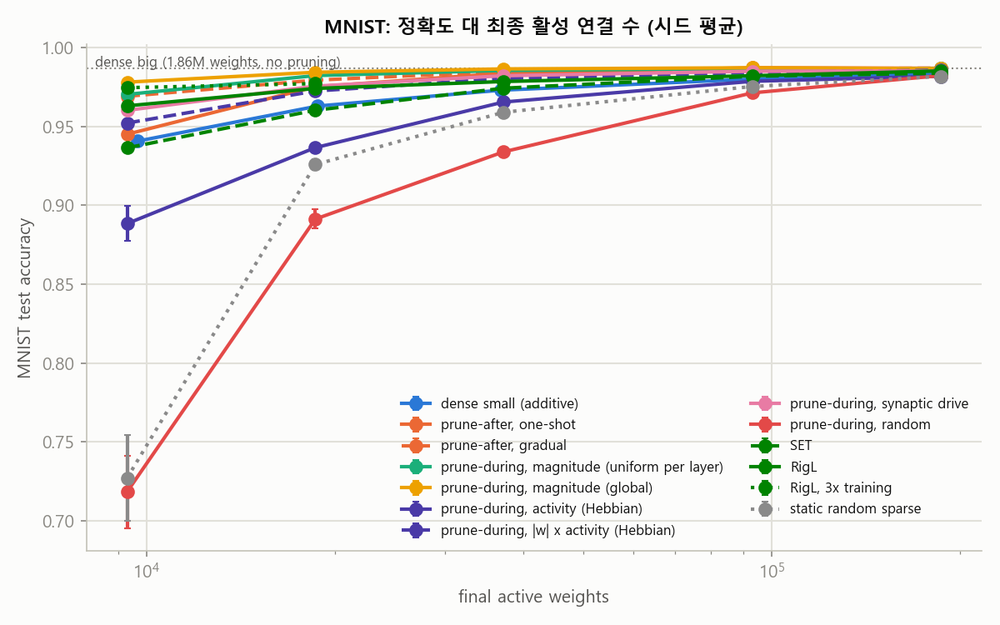
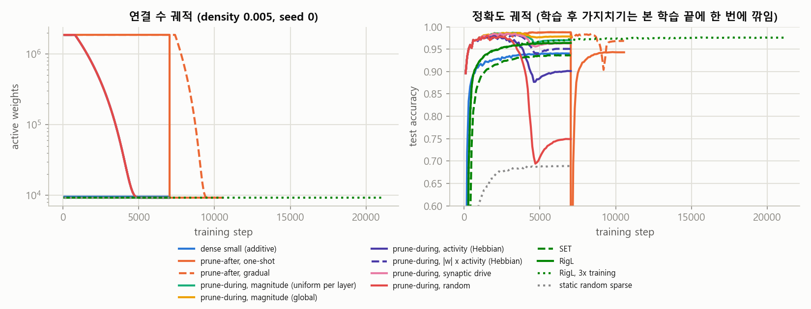
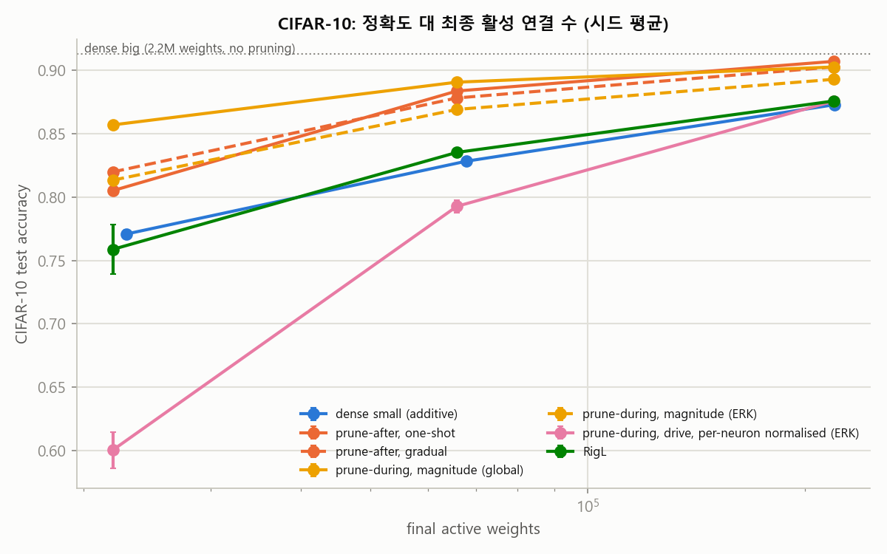
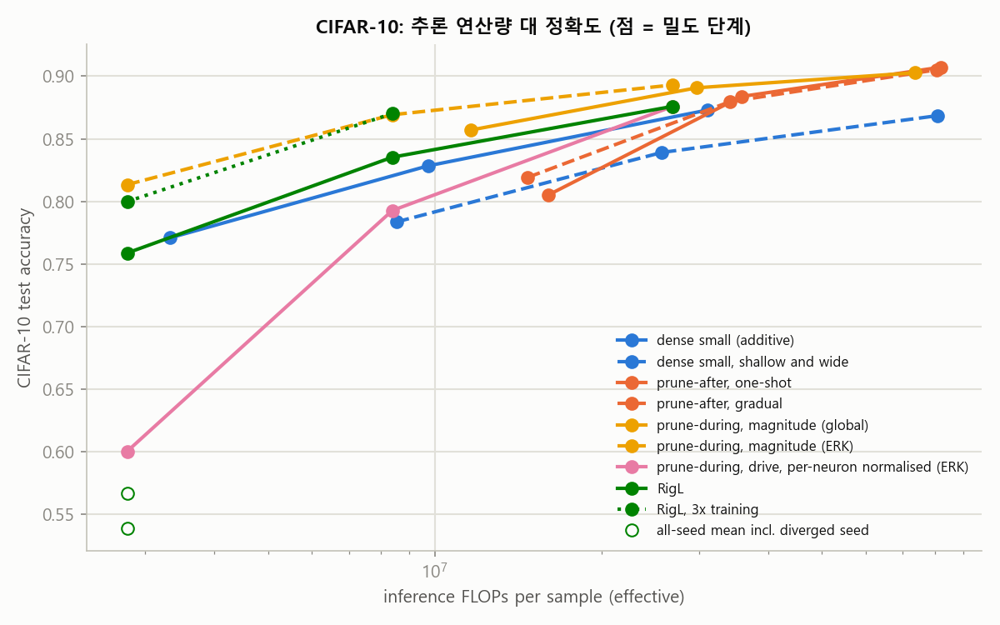
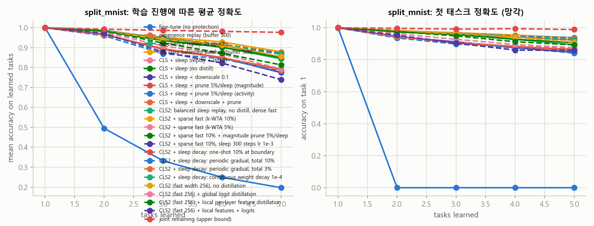
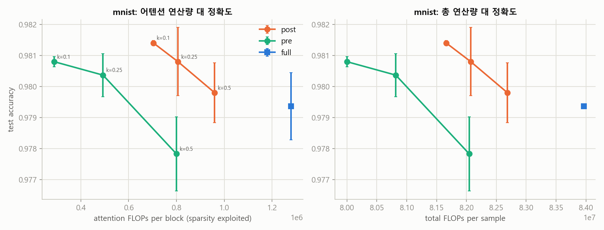
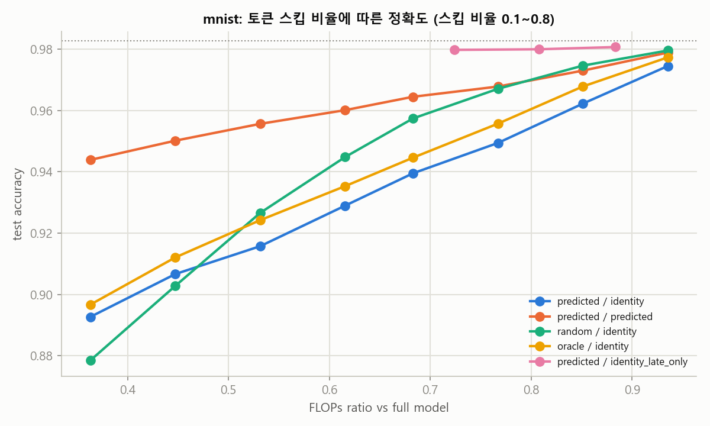
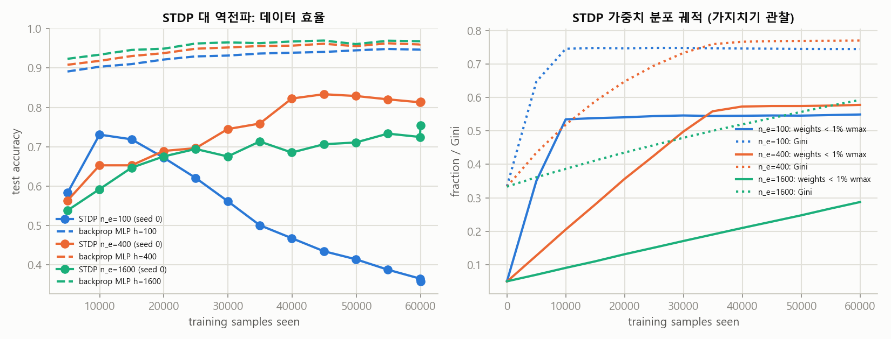
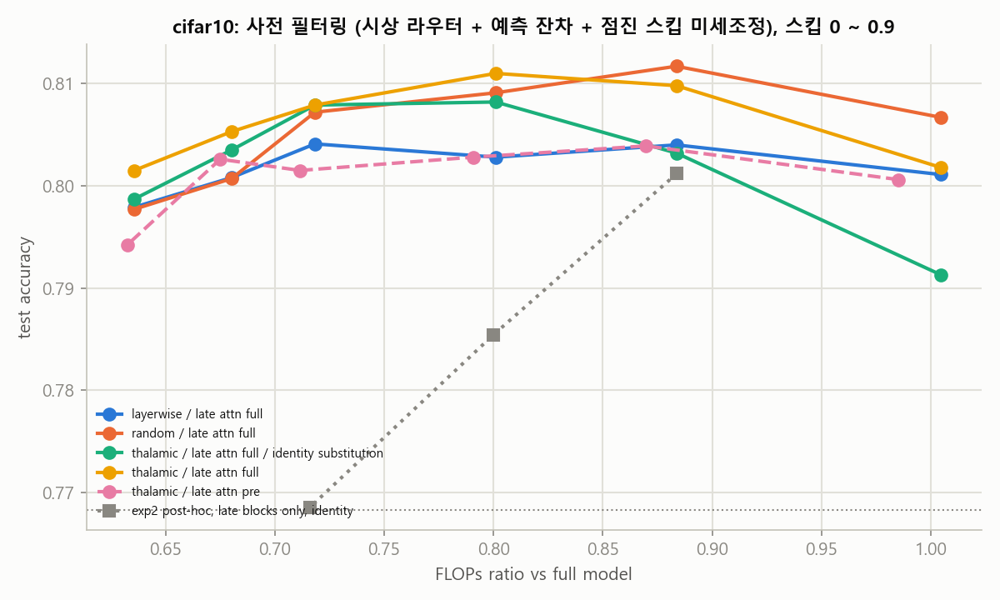

# Subtractive Intelligence 1차 실험 보고서

- 작성: 2026-10-01 새벽 (밤샘 실행, 00:35 ~ 05:30). 실행 환경: RTX 3060 Ti 8GB, Python 3.10, torch 2.11 cu128.
- 표는 `docs/report/tables/`, 그림은 `docs/report/figures/`에 있으며 `python scripts/analyze.py`로 다시 만들 수 있습니다.
- 모든 수치는 시드 3개 평균 +- 표준편차입니다. 시드 1개인 항목은 따로 표시합니다.
- 사용자 확정 제약에 따라 에너지와 전력은 측정하지 않았습니다. 비교 지표는 정확도, 이론 FLOPs, 망각 저항성,
  데이터 효율, 확신도 보정 다섯 가지입니다. 원리 2(HW=SW 통합)는 실험하지 않았습니다.
- 계획한 실행은 모두 끝났습니다(07:10). 실험 2 미세조정과 STDP 시드 0 재실행은 아침에 사용자 지시로 하나씩 돌렸고,
  핵심 실험의 CIFAR-10 확장(57런, 약 6시간)은 같은 날 오후에 끝났습니다(3.5절).

## 1. 요약

핵심 주장 "뇌는 학습 과정 자체가 가지치기"는 MNIST MLP에서 뚜렷하게 지지됩니다. 보조 실험 네 개 중 원안 그대로
살아남은 것은 없고, 각각 조건부 결과나 부정적 결과를 냈습니다. 논문은 핵심 실험 하나로 세우고 나머지는 부정적 결과를
포함한 보조 근거로 쓰는 것이 맞습니다.

| 실험 | 판정 | 근거 |
|---|---|---|
| 핵심: 학습 중 가지치기 | 지지 (MNIST, CIFAR-10 CNN, ResNet-18) | MNIST 연결 0.5%에서 97.8% 대 작은 dense 망 94.1%, 학습 후 가지치기 94.5%, RigL 96.3%. CIFAR-10 CNN 1%에서 85.7% 대 77.1% / 80.5% / 75.9%. ResNet-18 0.5%에서 89.0% 대 81.4% / 83.6% / 84.7% |
| 핵심: 지역 활동 규칙 | 조건부 | MNIST MLP에서는 시냅스 구동 규칙이 dense 망과 학습 후 가지치기를 이김(96.0%). CIFAR CNN에서는 원형이 붕괴하고 정규화 판도 1%에서 60%로 크게 뒤짐 |
| 실험 1: 희소 어텐션 | 조건부 | 사전 라우팅은 키 25%만으로 정확도 유지(MNIST 98.0, CIFAR 80.0)하며 어텐션 FLOPs 62~77% 절감. 그러나 총 FLOPs는 6.5~8.5% 절감. 통합 실험에서도 토큰 스킵 위에 얹으면 1%p 추가 절감에 0.1~0.6%p 손실 |
| 실험 2: 예측 코딩 스킵 | 조건부 | 전 층 균일 스킵은 무작위보다 나쁨. 뒤쪽 블록에만 적용하면 MNIST에서 70% 스킵에 손실 0.3%p, CIFAR에서는 30% 스킵에 1.7%p 손실. 스킵을 켠 채 미세조정하면 50% 스킵 손실이 MNIST 0.7%p, CIFAR 9~11%p로 줄지만 선택 기준은 무작위와 동률. 통합 설계(뒤쪽 블록만 + 예측 잔차 대체 + 시상 사전 결정)는 CIFAR 70% 스킵에 손실 1.0%p(FLOPs 28% 절감)이나 선택 기준은 여전히 무작위와 동률 |
| 실험 3: 이중 학습률 + 수면 | 기각 | Class-IL에서 해마-피질 증류가 망각을 키움(78.7 대 85.0). 감쇠와 가지치기는 두 설정 모두에서 무효. 재설계(희소 해마, 균형 리플레이, 증류 없음)에서 이득은 균형 리플레이 하나(ER +2.6%p)뿐이고 희소 해마와 수면 가지치기는 기여 없음 |
| 실험 4: STDP | 재현 | 400뉴런 6만 장 81.1%(역전파 96.5%). 학습 중 가중치 58%가 최대치의 1% 아래로 내려가는 자연 가지치기 관찰 |

## 2. 실행 조건

- 데이터: MNIST (핵심, 실험 1~4), CIFAR-10 (실험 1, 2의 ViT 변형, 시드 1).
- 모델: MLP 784-h-h-10, 소형 ViT (MNIST: patch 4, dim 128, depth 4, 토큰 50 / CIFAR: dim 192, depth 6, 토큰 65).
- FLOPs 규약: 1샘플 순전파, 곱셈과 덧셈을 각각 셈(matmul = 2MNK). 학습 FLOPs는 순전파의 3배 근사를 매 스텝의 실제
  활성 연결 수로 누적했습니다. SNN은 사건 구동 시냅스 연산(SOP)으로 셌습니다.
- 기준선 (표 `baselines.md`): MLP MNIST 98.4%, ViT MNIST 98.3%, ViT CIFAR-10 81.8% (50에폭, 시드 1).

## 3. 핵심 실험: 학습 중 가지치기

### 3.1 설계

과잉 초기화 망(784-1024-1024-10, 186만 연결)을 학습 중에 깎아 최종 연결 수를 예산 B에 맞춥니다. 같은 B에서
다음을 비교했습니다.

- dense small: 처음부터 B에 맞춘 작은 dense 망 (가산적 학습)
- 학습 중 가지치기: cubic 스케줄로 밀도 1에서 목표까지 100스텝마다 깎음, 재성장 없음. 규칙은 크기(층별/전역),
  헤비안 활동 상관, abs(w) x 활동, 시냅스 구동, 무작위
- 학습 후 가지치기: dense로 끝까지 학습 후 한 번에 전역 크기 가지치기, 절반 길이 미세조정
- SET / RigL: 처음부터 희소, 끊고 다시 잇기 (무작위 / gradient 재성장)
- static sparse: 무작위 고정 마스크

밀도 0.1, 0.05, 0.02, 0.01, 0.005 (연결 18.6만 ~ 9.3천), 15에폭, Adam, 시드 3.

### 3.2 결과

정확도 (표 `core_acc_matrix.md`, 그림 `core_acc_vs_active.png`):

| 밀도 | dense small | 학습 후 가지치기 | 학습 중 크기(전역) | 학습 중 크기(층별) | 학습 중 활동 | 학습 중 무작위 | SET | RigL |
|---|---|---|---|---|---|---|---|---|
| 0.1 | 98.36 | 98.69 | 98.67 | 98.67 | 98.19 | 98.23 | 98.38 | 98.53 |
| 0.05 | 98.01 | 98.73 | 98.72 | 98.68 | 97.87 | 97.13 | 98.19 | 98.22 |
| 0.02 | 97.30 | 98.38 | 98.65 | 98.55 | 96.55 | 93.39 | 97.43 | 97.85 |
| 0.01 | 96.30 | 97.52 | 98.44 | 98.23 | 93.66 | 89.13 | 96.03 | 97.41 |
| 0.005 | 94.07 | 94.51 | 97.81 | 97.04 | 88.85 | 71.84 | 93.65 | 96.31 |



- 학습 중 전역 크기 가지치기가 모든 밀도에서 1위이고, 희소할수록 격차가 커집니다. 연결 0.5%에서 dense small보다
  3.7%p, 학습 후 가지치기보다 3.3%p, RigL보다 1.5%p 높습니다.
- 학습 후 한 번에 깎는 방식은 밀도 2% 이하에서 급격히 나빠집니다. 그림 `core_trajectory.png`에서 깎는 순간 정확도가
  0.6 아래로 떨어졌다가 0.94까지만 회복합니다. 학습 중 점진 가지치기는 같은 구간에서 0.98을 유지합니다.
  즉 "깎는 것"이 아니라 "배우면서 점진적으로 깎는 것"이 효과의 원천입니다.
- 헤비안 상관 규칙은 실패했습니다. E[y_i x_j]는 시냅스 ij의 기여가 아니라 다른 경로를 통한 상관까지 섞기 때문입니다.
  abs(w) x 활동은 크기 단독보다 못했습니다.



### 3.3 비용, 데이터 효율, 보정

- 누적 학습 FLOPs (그림 `core_trainflops_vs_acc.png`): 학습 중 가지치기는 dense small의 3배(밀도 0.1)에서 50배(0.005)
  비용이 듭니다. 초반에 큰 망을 굴리기 때문입니다. 학습 후 가지치기는 그보다 3~4배 더 듭니다. RigL과 SET은 dense small과
  같은 비용입니다. 학습 비용 축에서는 RigL이 가장 효율적이고 정확도 2위입니다.
- 데이터 효율: 과잉 망은 97% 도달에 8.7만 표본이 필요했고 dense small은 13만~44만, RigL은 12만~44만이 필요했습니다.
  표본당 비용은 크지만 표본 수로는 가장 빨리 배웁니다 (그림 `core_data_efficiency.png`).
- 확신도 보정(ECE)은 0.004~0.015로 방식 간 차이가 작았습니다. 무작위 가지치기만 0.015로 나빴습니다.

### 3.4 시냅스 구동 규칙 (추가 실행)

헤비안 상관이 실패한 원인을 "시냅스별 기여를 못 잡는다"로 보고, STDP의 조건(시냅스 전 입력이 있고 후뉴런이 발화)을
시냅스 단위로 옮긴 규칙을 추가했습니다. 점수 = abs(w_ij) x E[1(후뉴런 i 발화) x abs(x_j)]. gradient는 쓰지 않습니다.

| 밀도 | 크기(전역) | 크기(층별) | 시냅스 구동 | abs(w) x 상관 | 헤비안 상관 | 참고: dense small / RigL |
|---|---|---|---|---|---|---|
| 0.1 | 98.67 | 98.67 | 98.53 | 98.57 | 98.19 | 98.36 / 98.53 |
| 0.05 | 98.72 | 98.68 | 98.50 | 98.42 | 97.87 | 98.01 / 98.22 |
| 0.02 | 98.65 | 98.55 | 98.22 | 98.05 | 96.55 | 97.30 / 97.85 |
| 0.01 | 98.44 | 98.23 | 97.56 | 97.25 | 93.66 | 96.30 / 97.41 |
| 0.005 | 97.81 | 97.04 | 96.03 | 95.22 | 88.85 | 94.07 / 96.31 |

- 지역 규칙의 순위는 시냅스 구동 > abs(w) x 상관 > 헤비안 상관으로, 시냅스 단위 기여를 볼수록 좋아집니다.
- 시냅스 구동 규칙은 크기 규칙에는 못 미치지만(0.5%에서 1.0~1.8%p 아래), 가산적 dense small(94.1), 학습 후
  가지치기(94.5), SET(93.7)보다 높고 RigL(96.3)에 근접합니다. 즉 gradient 없는 지역 규칙으로도 "학습 중 점진 가지치기"의
  이득 대부분을 얻을 수 있습니다. 논문에는 "크기 규칙을 대체하지는 못하지만 대안으로 성립한다"로 적는 것이 정확합니다.

### 3.5 CIFAR-10 확장 (소형 CNN, 시드 3, 표 `core_acc_matrix_cifar.md`, 그림 `core_*_cifar.png`)

VGG 풍 소형 CNN(conv 64-64/128-128/256-256, fc 256, 가중치 220만, BatchNorm)으로 같은 비교를 했습니다. SGD, 20에폭,
GPU 증강. 밀도 0.1 / 0.03 / 0.01(가중치 22만 / 6.6만 / 2.2만). 과잉 망 자체는 91.3%입니다. CNN에서는 층별 균일 밀도가
첫 conv(1,728개 가중치)를 굶겨 붕괴하므로 층별 규칙은 ERK 배분으로 목표를 주었고, 크기 규칙도 같은 배분으로 돌려
규칙만 비교되게 했습니다. 시냅스 구동 규칙 원형은 CNN에서 붕괴해(발화가 적은 채널의 입력이 통째로 잘려 채널이 죽음)
후뉴런별로 정규화한 판을 썼습니다.

| 밀도 | dense small | 학습 후 가지치기 | 학습 중 크기(전역) | 학습 중 크기(ERK) | 학습 중 구동 정규화(ERK) | RigL (ERK) |
|---|---|---|---|---|---|---|
| 0.1 | 87.3 | 90.7 | 90.3 | 89.3 | 87.6 | 87.6 |
| 0.03 | 82.8 | 88.4 | 89.1 | 86.9 | 79.3 | 83.5 |
| 0.01 | 77.1 | 80.5 | 85.7 | 81.3 | 60.0 | 75.9 (2시드) / 1시드 붕괴 |

| 밀도 | 추론 FLOPs: dense small | 크기(전역) | 크기(ERK) | RigL |
|---|---|---|---|---|
| 0.1 | 3.1e7 | 7.4e7 | 2.7e7 | 2.7e7 |
| 0.03 | 9.7e6 | 3.0e7 | 8.4e6 | 8.4e6 |
| 0.01 | 3.3e6 | 1.2e7 | 2.8e6 | 2.8e6 |





- MNIST와 같은 결론입니다. 학습 중 전역 크기 가지치기가 1%에서 dense small보다 8.6%p, 학습 후 가지치기보다 5.2%p 높고,
  희소할수록 격차가 커집니다. 학습 후 한 번에 깎는 방식은 깎는 순간 우연 수준으로 떨어졌다가 80%까지만 회복합니다.
- 같은 가중치 수가 같은 연산량은 아닙니다. 전역 크기 가지치기는 conv를 남기고 fc를 잘라 dense small보다 추론 FLOPs가
  2.4~3.5배 큽니다. 연산량을 ERK 배분으로 묶어 dense small 이하로 맞춰도(1%에서 2.8e6 대 3.3e6) 학습 중 가지치기가
  4.2%p 높습니다. 즉 이득은 FLOPs 축에서도 남습니다.
- RigL은 1%에서 3시드 중 1개가 학습 초반에 우연 수준으로 발산했습니다(ERK 배분에서 중간 conv 밀도가 0.3~0.6%). 살아남은
  2시드 평균 75.9%도 dense small(77.1%) 아래입니다. 3%와 10%에서는 dense small과 같거나 약간 위입니다.
- 지역 규칙은 CNN에서 약합니다. 정규화한 구동 규칙은 10%에서 dense small과 동률이지만 3%에서 3.5%p, 1%에서 17%p 뒤집니다.
  MNIST MLP에서 성립하던 "gradient 없는 지역 규칙으로 이득 대부분을 얻는다"는 CNN 고희소 영역에서는 성립하지 않습니다.
- 학습 비용은 MNIST와 같은 구조입니다. 학습 중 가지치기는 dense small의 4.5~31배, 학습 후 가지치기는 그보다 3~4배 더 듭니다.

### 3.5b ResNet-18 확장 (CIFAR-10, 11.2M 가중치, 시드 3, 표 `core_acc_matrix_resnet.md`, 그림 `core_*_resnet.png`)

CIFAR용 ResNet-18(과잉 망 92.5%)로 같은 비교를 했습니다. SGD lr 0.1, 20에폭, 밀도 0.05 / 0.02 / 0.005(가중치 56만 / 22만 / 5.6만).

| 밀도 | dense small | 학습 후 가지치기 | 학습 중 크기(전역) | 학습 중 크기(ERK) | RigL (ERK) |
|---|---|---|---|---|---|
| 0.05 | 88.7 | 92.3 | 92.0 | 92.0 | 91.0 |
| 0.02 | 86.5 | 90.9 | 91.5 | 91.3 | 89.5 |
| 0.005 | 81.3 | 83.6 | 89.0 | 87.8 | 84.9 |

| 밀도 | 추론 FLOPs: dense small | 크기(전역) | 크기(ERK) | RigL |
|---|---|---|---|---|
| 0.05 | 5.6e7 | 1.9e8 | 1.4e8 | 1.4e8 |
| 0.02 | 2.3e7 | 1.1e8 | 5.7e7 | 5.7e7 |
| 0.005 | 6.1e6 | 3.4e7 | 1.4e7 | 1.4e7 |

- 순위가 그대로이고 격차는 가장 큽니다. 0.5%에서 학습 중 전역 가지치기가 dense small보다 7.7%p, 학습 후 가지치기보다 5.4%p,
  RigL보다 4.1%p 높습니다. 5%에서는 큰 망 출발 세 경로가 0.2%p 안에 모여 과잉 망 상한에 붙습니다. 예산이 빡빡할 때만
  경로가 중요합니다.
- ERK 판은 0.5%에서 전역 판의 40% 추론 FLOPs로 1.2%p만 낮고(87.8), 같은 FLOPs의 RigL보다 2.9%p 높습니다.
- 학습 비용은 0.5%에서 dense small의 59배, 학습 후 가지치기 185배, RigL 2.3배입니다.
- 모델 크기를 5배 키워도 "학습 중 점진 제거"의 이득과 희소할수록 커지는 격차가 재현됐습니다.

### 3.5c 사전 학습 ResNet-18 전이: 적응하며 깎기 (실험 A, 시드 2, 표 `core_pretrained_summary.md`, 그림 `core_pretrained_*.png`)

"큰 망 출발이 비싸다"는 약점에 대한 답입니다. ImageNet 사전 학습 ResNet-18(conv 가중치 1,117만, 새 분류층은 밀집 유지)을
128x128로 키운 CIFAR-10에 10에폭 적응시키면서 같은 cubic 일정으로 5% / 2% / 0.5%까지 깎았습니다. 비교 팔은 같은 가중치의
원샷 가지치기 후 미세조정, 사전 학습 가중치 위의 무작위 ERK 마스크 + RigL, 그리고 같은 구조·일정·해상도로 처음부터 학습한
두 경로(학습 중 가지치기, dense small)입니다. 사전 학습 비용은 모든 사전 학습 팔에 공통인 매몰 비용이라 표에 넣지 않았습니다.

| 출발 | 경로 | 5% | 2% | 0.5% | 적응 FLOPs (5%) |
|---|---|---|---|---|---|
| 사전 학습 | 적응 중 가지치기 (전역 크기) | **93.7** | **91.0** | 80.9 | 7.3e14 |
| 사전 학습 | 적응 중 가지치기 (ERK) | 93.4 | 89.7 | 78.8 | 8.1e14 |
| 사전 학습 | 원샷 가지치기 + 미세조정 | 93.1 | 90.3 | 81.7 | 3.0e14 |
| 사전 학습 | 무작위 ERK 마스크 + RigL | 86.9 | 83.6 | 76.8 | 2.7e14 |
| 처음부터 | 학습 중 가지치기 (전역 크기) | 88.4 | 87.5 | **83.8** | 7.7e14 |
| 처음부터 | dense small | 84.8 | 82.4 | 76.5 | 1.1e14 |

밀집 미세조정(깎지 않음)은 95.9%, 적응 FLOPs 1.8e15입니다.

- 5%와 2%에서 사전 학습 출발은 처음부터 학습한 가지치기보다 5.3%p, 3.5%p 높고, 적응 중 점진 제거는 같은 가중치의 원샷
  가지치기보다 0.6~0.7%p 높습니다. RigL은 물려받은 구조를 버리고 희소하게 시작해야 해서 처음부터 학습한 가지치기보다도 낮습니다.
- 사전 학습 팔은 1에폭(약 5.2만 표본) 안에 90%에 도달하고 보정도 더 좋습니다(ECE 0.016~0.020 대 처음부터 0.028~0.031).
  적응 비용은 밀집 미세조정의 40%입니다.
- **0.5%에서는 순위가 뒤집힙니다.** 처음부터 학습(83.8) > 원샷(81.7) > 사전 학습 적응 중 가지치기(80.9)입니다. 사전 학습
  팔은 일정 중간에 93.1%까지 올라갔다가 마지막 4.5%의 연결을 떼는 동안 12%p를 잃습니다. 10에폭 중 최종 밀도에서 보내는
  시간이 3에폭뿐인데, 원샷은 10에폭을 모두 최종 밀도에서 보냅니다. 물려받은 구조는 2%까지는 공짜 출발점이고 그 아래에서는
  짐이 됩니다. 다른 과제에 맞춰진 크기 분포가 극단 희소에서는 방해가 되고, 짧은 적응 창에서는 한 번에 떼는 쪽이 유리합니다.
- 논문 관점: "공짜 대리석" 논지는 5%와 2%에서 성립하고 0.5%에서 반증됩니다. 두 결과를 모두 적었습니다(논문 Table 4, Discussion).

### 3.6 논문 관점 해석

- 살아남는 주장: "같은 최종 연결 예산에서 학습 중 점진 가지치기는 가산적 학습과 학습 후 가지치기를 모두 이기며,
  희소할수록 격차가 커진다. 그 이득은 '깎는다'가 아니라 '배우면서 깎는다'에서 나온다."
- 정직하게 같이 낼 것: 누적 학습 비용은 감산 쪽이 훨씬 크다는 표. 효율 프런티어에서는 RigL이 강하다는 사실.
- 선행 연구와의 거리: 점진 크기 가지치기(Zhu & Gupta 2017)와 동적 희소 학습(RigL)이 가깝습니다. 이 실험의 기여는
  같은 표에 다섯 지표를 함께 놓고 "학습 후 대 학습 중"을 극단 희소까지 직접 비교한 것, 지역 규칙의 순위를 밝힌 것,
  그리고 STDP에서 같은 현상(자연 희소화)이 나타남을 보인 것입니다. CIFAR-10 CNN에서 같은 순위가 재현됐으므로 데이터셋 두 개로 본 학회 투고가 가능한 범위에 들어왔습니다. ImageNet급 확장과
  ResNet 계열 검증은 다음 단계입니다.

## 4. 실험 3: 이중 학습률 + 수면

### 4.1 설계

Split MNIST Class-IL (5 태스크 x 2 클래스, 단일 헤드), Permuted MNIST (10 태스크). MLP 784-256-256-10, 태스크당 3에폭.
fast(해마)는 높은 학습률로 스트림만 학습하고, slow(피질)는 수면 단계에서만 현재 태스크 데이터와 버퍼(500) 리플레이,
fast로부터의 증류로 학습합니다. 수면 시작 때 전역 감쇠, 수면 끝에 약한 연결 가지치기를 선택적으로 넣었습니다.
대조군은 fine-tune, 경험 리플레이(ER, 버퍼 500), ER 2배 에폭, joint(상한)입니다.

### 4.2 Split MNIST (표 `exp3_split_mnist.md`, 그림 `exp3_split_mnist.png`)

| 방법 | 평균 정확도 | 망각 | 유지율 | ECE | 학습 FLOPs | 미지 클래스 AUROC |
|---|---|---|---|---|---|---|
| fine-tune | 19.7 | 0.995 | 0.00 | 0.731 | 2.9e11 | 0.65 |
| ER (버퍼 500) | 85.2 | 0.175 | 0.82 | 0.087 | 5.8e11 | 0.85 |
| ER 2배 에폭 | 84.3 | 0.189 | 0.81 | 0.105 | 1.2e12 | 0.84 |
| CLS + 수면 (증류) | 78.7 | 0.254 | 0.74 | 0.123 | 1.8e12 | 0.77 |
| CLS + 수면 (증류 없음) | 85.0 | 0.179 | 0.82 | 0.090 | 1.8e12 | 0.83 |
| + 전역 감쇠 0.1 | 77.4 | 0.270 | 0.73 | 0.133 | 1.8e12 | 0.78 |
| + 가지치기 5%/수면 (크기) | 79.2 | 0.249 | 0.75 | 0.118 | 1.8e12 | 0.78 |
| + 가지치기 5%/수면 (활동) | 78.0 | 0.258 | 0.74 | 0.107 | 1.8e12 | 0.74 |
| + 감쇠 + 가지치기 | 78.8 | 0.254 | 0.74 | 0.121 | 1.8e12 | 0.77 |
| joint (상한) | 97.6 | 0.009 | 0.99 | 0.005 | 8.8e11 | 0.93 |



- 해마에서 피질로의 증류는 망각을 키웁니다 (78.7 대 85.0). fast 망이 현재 태스크에만 치우쳐 있어 그 편향을 옮기기
  때문입니다. 증류를 빼면 CLS는 ER과 같은 수준이지만 비용이 3배입니다.
- 수면 단계의 전역 감쇠와 가지치기는 3시드 기준으로 망각을 줄이지 못했습니다. 감쇠는 오히려 해칩니다.
- 확신도로 "아직 안 배운 클래스"를 가려내는 능력(AUROC)은 softmax 확신도가 0.83~0.85이고, fast-slow 합의도는
  0.51로 무용합니다. fast가 옛 태스크를 잊어 합의도가 "모름"이 아니라 "옛것"을 가리키기 때문입니다.
- 확신도 보정 자체는 쓸 만합니다. ER은 확신도 상위 50%만 답하면 정확도 98.5%입니다 (전체 85.2%).

### 4.3 Permuted MNIST (표 `exp3_permuted_mnist.md`, 그림 `exp3_permuted_mnist.png`)

| 방법 | 평균 정확도 | 망각 | 유지율 | ECE | 학습 FLOPs |
|---|---|---|---|---|---|
| fine-tune | 48.9 | 0.538 | 0.45 | 0.502 | 2.9e12 |
| ER (버퍼 500) | 87.4 | 0.112 | 0.89 | 0.187 | 5.8e12 |
| ER 2배 에폭 | 82.7 | 0.165 | 0.83 | 0.214 | 1.2e13 |
| CLS + 수면 (증류) | 87.8 | 0.094 | 0.90 | 0.110 | 6.0e12 |
| CLS + 수면 (증류 없음) | 88.6 | 0.085 | 0.91 | 0.125 | 6.0e12 |
| + 전역 감쇠 0.1 | 82.7 | 0.151 | 0.84 | 0.151 | 6.0e12 |
| + 가지치기 5%/수면 (크기) | 87.3 | 0.097 | 0.90 | 0.130 | 6.0e12 |
| + 가지치기 5%/수면 (활동) | 81.5 | 0.160 | 0.83 | 0.195 | 6.0e12 |
| + 감쇠 + 가지치기 | 83.7 | 0.138 | 0.86 | 0.120 | 6.0e12 |
| joint (상한) | 96.3 | 0.003 | 1.00 | 0.007 | 8.9e12 |

- 도메인 증분(모든 태스크에 10개 클래스가 다 있음)에서는 CLS + 수면이 ER보다 1.2%p 높고 망각도 적으며 시드 분산이
  작습니다. 비용은 ER과 같습니다. 증류가 여기서는 해롭지 않습니다. fast 망이 클래스 편향을 갖지 않기 때문입니다.
- 전역 감쇠와 활동 기준 가지치기는 여기서도 해롭고, 크기 기준 가지치기 5%/수면은 중립입니다.
- ER의 ECE(0.19)가 CLS(0.11~0.13)보다 나쁩니다. 수면 단계에서 현재 태스크 전체를 다시 보는 것이 보정을 돕는 것으로 보입니다.

### 4.4 해석

원안의 수면 가설(전역 감쇠 + 가지치기가 망각을 줄인다)은 두 설정 모두에서 기각입니다. 이중 학습률 구조 자체는
도메인 증분에서 소폭 이득이 있지만 클래스 증분에서는 증류가 독이 됩니다. 논문에는 "리플레이 대비 추가 이득은 도메인 증분에
한정되며 수면 단계의 감산 요소는 효과가 없다"로 적고, 향후 방향으로 클래스 균형 교사나 생성 리플레이를 제시하는 것이 맞습니다.

### 4.5 재설계 (희소 해마 + 균형 리플레이 + 증류 없음 + 크기 가지치기만, 시드 3)

실패 원인을 "해마가 현재 태스크에 치우쳐 편향을 피질에 옮긴다"로 보고 네 가지를 바꿨습니다. 해마 망 은닉층에 k-WTA(활성
5~10%)로 패턴 분리를 강제하고, 증류를 빼고, 리플레이 배치를 지금까지 본 (태스크, 클래스) 그룹이 같은 수가 되게 구성하고,
수면 가지치기는 크기 기준만 남겼습니다. 균형 리플레이 효과를 따로 보기 위해 온라인 ER의 균형 판을 대조군으로 넣었습니다.

| 방법 | Split MNIST 평균 정확도 | 망각 | Permuted MNIST 평균 정확도 | 망각 |
|---|---|---|---|---|
| ER (버퍼 500) | 85.2 | 0.175 | 87.4 | 0.112 |
| 기존 CLS + 수면 (증류 없음) | 85.0 | 0.179 | 88.6 | 0.085 |
| ER + 균형 배치 | 87.8 | 0.130 | 88.3 | 0.076 |
| CLS2: 균형 수면 리플레이, 증류 없음 | 87.0 | 0.153 | 89.0 | 0.066 |
| CLS2 + 희소 해마 (k-WTA 10% / 5%) | 87.0 / 87.0 | 0.153 | 89.0 / - | 0.066 |
| CLS2 + 크기 가지치기 5%/수면 | 86.9 | 0.155 | - | - |
| 해마 단독 추론 | 19.7 | 0.997 | 37~43 | 0.6 |
| 해마·피질 중 확신도 높은 쪽 | 66~68 | 0.39 | 85.8~87.1 | 0.11~0.13 |
| joint (상한) | 97.6 | 0.009 | 96.3 | 0.003 |

- 효과가 있는 요소는 균형 리플레이 하나입니다. 온라인 ER에 넣기만 해도 Split에서 +2.6%p, Permuted에서 +0.9%p이고 망각이
  가장 많이 줄었습니다. 알려진 기법(class-balanced replay)의 재확인입니다.
- 희소 해마는 기여가 없습니다. 증류를 빼는 순간 피질은 해마와 완전히 분리되어 해마의 희소성이 피질 결과에 영향을 줄 경로가
  없고(같은 시드에서 dense/10%/5%의 피질 결과가 동일), 은닉층 k-WTA는 공유 출력층의 간섭을 막지 못해 해마 자체도 Class-IL에서
  완전 망각합니다. 해마가 피질에 기여하려면 전달 경로가 필요한데, 증류는 편향을 옮깁니다. 이 딜레마가 남은 문제입니다.
- 수면 크기 가지치기는 중립, 확신도 선택 결합은 해롭습니다. 감산 요소가 망각을 줄인다는 근거는 여전히 없습니다.
- 균형을 클래스만으로 잡으면 Permuted MNIST에서 버퍼가 전혀 쓰이지 않아 52%로 무너집니다. (태스크, 클래스) 그룹 기준이어야
  두 설정에서 모두 성립합니다.
- 논문 관점: "빼기로 학습하면 망각도 줄어든다"는 이 설정에서 지지되지 않습니다. 망각 이야기를 살리려면 핵심 실험의
  망(학습 중 가지치기로 희소해진 망)이 dense 망보다 순차 학습에서 덜 간섭하는지를 직접 재는 실험이 필요합니다. PackNet 계열과
  가까워지지만 "학습 과정이 가지치기"라는 주장과 직접 이어집니다.

### 4.6 논문 2 토대: 수면 감쇠 스케줄과 증류 국소성 (시드 3, 표 `paper2_*.md`, 그림 `paper2_*.png`)

뇌→폰 노이만 번역 사전(docs/notes/brain_to_von_neumann_translation.md)의 첫 두 항목을 CLS2(희소 해마 k-WTA 10%) 위에서
측정했습니다.

| 변형 | Split MNIST (Δ) | Permuted MNIST (Δ) |
|---|---|---|
| 기준: CLS2 k-WTA 10%, 감쇠 없음 | 87.0 | 89.0 |
| 경계 1회 하향 10% | +0.3 | -4.0 |
| 수면 중 점진 감쇠, 총 10% | +0.3 | -3.5 |
| 수면 중 점진 감쇠, 총 3% | +0.5 | -0.3 |
| 수면 중 연속 가중치 감쇠 1e-4 | +0.1 | -0.5 |
| 기준: 빠른 망 폭 256, 증류 없음 | 85.5 | 89.4 |
| 전역 로짓 증류 | -6.2 | -1.6 |
| 층별 국소 특징 증류 | -4.2 | -4.2 |
| 국소 특징 + 로짓 | -11.5 | -5.9 |

- 수면 감쇠는 어떤 일정으로 해도 Split에서는 오차 범위, Permuted에서는 손해입니다. 점진으로 하면 손해가 줄지만 이득으로
  바뀌지는 않습니다. 시냅스 항상성의 소프트웨어 번역은 이 설정에서 근거가 없습니다.
- 증류는 전역이든 국소든 모두 해롭습니다. 국소 특징 증류가 전역보다 나은 것은 Split에서만이고 Permuted에서는 더 나쁩니다.
  "분산 증류가 전역 증류보다 낫다"는 가설은 지지되지 않습니다.
- 논문 1에는 수면 문단에 한 문장으로 반영했습니다. 논문 2의 번역 사전에서 이 두 항목은 "번역해도 안 됨"으로 적어야 합니다.

## 5. 실험 1: 억제 기반 희소 어텐션과 사전 라우팅

### 5.1 설계

원안(사후 top-k 마스킹)은 점수 행렬을 다 계산한 뒤 지우므로 이론 FLOPs가 줄지 않습니다. 대조군으로 두고, 시상의
사전 필터링에 해당하는 사전 라우팅을 추가했습니다. 헤드별 저차원 투영(헤드 차원에서 8차원)으로 라우팅 점수를 만들어
쿼리마다 상위 k개 키를 고르고, 전차원 어텐션은 그 k개에만 계산합니다. 라우터는 학습 중에만 계산하는 전체 어텐션
분포를 교사로 KL로 학습합니다. MNIST ViT(토큰 50), 8에폭, 시드 3. CIFAR-10 ViT(토큰 65), 30에폭, 시드 1.

### 5.2 MNIST (표 `exp1_mnist.md`, 그림 `exp1_mnist.png`)

| 모드 | 유지 비율 | 키 수 | 정확도 | ECE | 어텐션 FLOPs/블록 (희소성 활용) | 총 FLOPs 비율 |
|---|---|---|---|---|---|---|
| full | 1 | 50 | 97.94 | 0.005 | 1.28e6 | 1.000 |
| 사후 마스킹 | 0.5 | 25 | 97.98 | 0.004 | 9.6e5 | 0.985 |
| 사후 마스킹 | 0.25 | 13 | 98.08 | 0.005 | 8.1e5 | 0.977 |
| 사후 마스킹 | 0.1 | 5 | 98.14 | 0.004 | 7.0e5 | 0.973 |
| 사전 라우팅 | 0.5 | 25 | 97.78 | 0.006 | 8.0e5 | 0.964 |
| 사전 라우팅 | 0.25 | 13 | 98.04 | 0.004 | 4.9e5 | 0.935 |
| 사전 라우팅 | 0.1 | 5 | 98.08 | 0.005 | 2.9e5 | 0.915 |



### 5.3 CIFAR-10 (시드 1, 표 `exp1_cifar10.md`, 그림 `exp1_cifar10.png`)

| 모드 | 유지 비율 | 키 수 | 정확도 | ECE | 어텐션 FLOPs/블록 (희소성 활용) | 총 FLOPs 비율 |
|---|---|---|---|---|---|---|
| full | 1 | 65 | 79.40 | 0.035 | 3.24e6 | 1.000 |
| 사후 마스킹 | 0.25 | 17 | 80.27 | 0.033 | 2.05e6 | 0.980 |
| 사전 라우팅 | 0.25 | 17 | 80.03 | 0.036 | 1.05e6 | 0.935 |

- 키를 5~17개만 남겨도 정확도가 떨어지지 않고 오히려 0.1~0.9%p 오릅니다. 억제가 정규화로 작용합니다.
- 사전 라우팅은 어텐션 FLOPs를 62~77% 줄이지만 총 FLOPs는 6.5~8.5%만 줍니다. 토큰 50~65개 ViT에서 어텐션 행렬곱이
  블록 연산의 5% 안팎이기 때문입니다. 원안의 "FLOPs 50% 감소"는 어텐션만 희소화해서는 이 규모에서 불가능하고,
  토큰이 수백 개 이상인 설정에서만 의미가 커집니다.

## 6. 실험 2: 예측 오차 기반 토큰 스킵

### 6.1 설계

정적 이미지에는 시간축이 없으므로 "층 i가 토큰을 얼마나 바꿀지"를 저랭크 예측기(랭크 16)로 미리 추정하고, 변화가
작다고 예측된 토큰은 그 블록을 건너뜁니다. 학습된 ViT 위에서 사후 적용했습니다(예측기만 3에폭 학습). 점수는
predicted(제안), random(대조), oracle(실제 잔차, 상한)이고, 대체값은 identity(그대로) 또는 predicted(예측 잔차 더함)입니다.
CLS 토큰은 항상 계산하고, 스킵된 토큰도 키와 값으로는 남습니다.

### 6.2 MNIST (시드 3, 표 `exp2_mnist.md`, 그림 `exp2_mnist.png`)

| 점수 / 대체 | 스킵 0.3 | 스킵 0.5 | 스킵 0.7 | 스킵 0.8 | FLOPs 비율 (0.5 / 0.8) |
|---|---|---|---|---|---|
| 원본 | 98.27 | | | | 1.000 |
| predicted / identity (전 층) | 94.94 | 92.90 | 90.66 | 89.27 | 0.616 / 0.363 |
| oracle / identity (전 층) | 95.57 | 93.53 | 91.21 | 89.67 | 0.616 / 0.363 |
| random / identity (전 층) | 96.71 | 94.48 | 90.28 | 87.85 | 0.616 / 0.363 |
| predicted / predicted (전 층) | 96.78 | 96.01 | 95.02 | 94.39 | 0.616 / 0.363 |
| predicted / identity (뒤쪽 2블록만) | 98.07 | 98.00 | 97.98 | | 0.808 / 0.724 (0.5 / 0.7) |



### 6.3 CIFAR-10 (시드 1, 표 `exp2_cifar10.md`, 그림 `exp2_cifar10.png`)

| 점수 / 대체 | 스킵 0.3 | 스킵 0.5 | 스킵 0.8 | FLOPs 비율 (0.3 / 0.5 / 0.8) |
|---|---|---|---|---|
| 원본 | 81.86 | | | 1.000 |
| predicted / identity (전 층) | 66.47 | 51.49 | 30.03 | 0.768 / 0.600 / 0.354 |
| oracle / identity (전 층) | 69.53 | 55.31 | | |
| random / identity (전 층) | 72.45 | 58.54 | 35.29 | |
| predicted / predicted (전 층) | | 63.73 | 44.22 | |
| predicted / identity (뒤쪽 3블록만) | 80.12 | 78.54 | 76.85 (0.7) | 0.884 / 0.800 / 0.716 |

- 전 층에 균일하게 적용하면 "변화가 작을 토큰"을 고르는 것이 무작위보다 나쁩니다. 오라클도 마찬가지입니다.
  배경 토큰이 모든 층에서 일관되게 멈춰 CLS 어텐션이 왜곡되는 반면, 무작위 스킵은 어느 토큰도 완전히 멈추지 않기 때문입니다.
- 예측 잔차로 대체하면 개선됩니다. MNIST에서는 80% 스킵(FLOPs 36%)에 94.4%입니다. 저랭크 예측기가 블록의 값싼 근사로 작동합니다.
- 뒤쪽 블록에만 적용하면 MNIST에서 70% 스킵(FLOPs 28% 절감)에 손실 0.3%p, CIFAR-10에서는 30% 스킵(FLOPs 12% 절감)에
  1.7%p, 70% 스킵에 5.0%p 손실입니다. 예측기의 상대 MSE는 MNIST [0.27, 0.58, 0.52, 0.28], CIFAR [0.42, 0.45, 0.52, 0.50, 0.51, 0.48]로
  CIFAR는 모든 블록의 변화가 예측하기 어렵습니다.
- 원안의 "변한 것만 처리"는 표현이 안정된 뒤쪽 층에서만 성립하고, 사후 적용만으로는 어려운 데이터에서 무너집니다.

### 6.4 학습 시 적응 (스킵을 켠 채 미세조정, 표 `exp2_finetune_*.md`, 그림 `exp2_finetune_*.png`)

스킵 0.5로 ViT와 예측기를 함께 미세조정(MNIST 2에폭 시드 2, CIFAR 3에폭 시드 1)한 뒤 여러 스킵 비율에서 평가했습니다.
학습 시 기준(predicted / random)과 평가 시 기준을 교차했습니다.

| 데이터 | 학습 기준 → 평가 기준 | 미세조정 전 (0.5) | 스킵 0.5 | 스킵 0.8 | 원본 |
|---|---|---|---|---|---|
| MNIST | predicted → predicted | 93.9 | 97.6 | 96.5 | 98.3 |
| MNIST | random → random | 94.5 | 97.6 | 96.3 | 98.3 |
| MNIST | predicted → random | | 96.2 | 93.0 | |
| CIFAR-10 | predicted → predicted | 52.2 | 70.8 | 59.2 | 81.8 |
| CIFAR-10 | random → random | 58.8 | 72.6 | 54.7 | 81.8 |

- 적응이 핵심입니다. MNIST에서는 50% 스킵의 손실이 사후 적용 4.4%p에서 0.7%p로, 80% 스킵도 1.8%p로 줄었습니다.
  CIFAR-10에서는 50% 스킵 손실이 30%p에서 9~11%p로 줄었지만 여전히 큽니다.
- 선택 기준은 거의 중요하지 않습니다. 학습 때 쓴 기준으로 평가하면 predicted와 random이 같은 정확도에 이르고,
  기준을 바꿔 평가하면 떨어집니다. 즉 망이 "어떤 토큰이 건너뛰어질지"에 적응하는 것이지 예측 변화량 자체가 정보를 주는 것은
  아닙니다. 극단 스킵(80%)에서만 predicted가 CIFAR에서 4.5%p 앞섭니다.
- 결론: 예측 코딩 가설의 "변화가 작은 것을 건너뛴다"는 선택 규칙은 토큰 수준에서는 무작위 대비 이득이 없고, 이득은
  뒤쪽 층 한정 적용(6.2~6.3절)과 학습 시 적응에서 나옵니다.

## 7. 실험 4: STDP

### 7.1 설계

Diehl & Cook(2015) 구조를 순수 PyTorch로 GPU 벡터화했습니다. 입력 784 포아송(픽셀 x 32 Hz, 250 ms, dt 1 ms),
흥분성 LIF 400개(적응 임계 0.05, 불응기 5 ms), 흥분층 내 재귀 억제 17.5(승자독식), 흔적 기반 STDP(nu 1e-4 / 1e-2),
뉴런별 입력 가중치 합 정규화 78.4. 배치 32, STDP 갱신 합산. 라벨은 뉴런별 최다 반응 클래스로 배정합니다.
brian2는 Windows에서 빌드되지 않아 쓰지 않았습니다. 대조군은 같은 폭의 MLP 784-400-10을 같은 표본을 한 번 훑는 역전파입니다.

### 7.2 결과 (400뉴런 시드 3, 100/1600뉴런 시드 1, 표 `exp4.md`, 그림 `exp4.png`)

| 항목 | STDP 400뉴런 | 역전파 MLP 784-400-10 |
|---|---|---|
| 정확도 (6만 장 1회) | 81.1 +- 0.3 | 96.5 +- 0.2 |
| 추론 연산/이미지 | 4.3e5 SOP | 6.4e5 FLOPs |
| 학습 연산 총량 | 4.6e10 | 1.1e11 |
| 80% 도달 표본 수 | 3.8만 | 0.5만 |
| 학습 후 최대치 1% 이하 가중치 비율 | 57.7% (시작 5.5%) | 해당 없음 |

| 뉴런 수 | STDP 정확도 | 역전파 MLP (같은 폭) | 추론 SOP/이미지 | 1% 이하 가중치 비율 |
|---|---|---|---|---|
| 100 | 37.0 (시드 1) | 94.7 | 1.1e5 | 54.9% |
| 400 | 81.1 +- 0.3 | 96.5 | 4.3e5 | 57.7% |
| 1600 | 72.9 (시드 1) | 96.8 | 1.7e6 | 28.7% |

- 100뉴런과 1600뉴런은 400뉴런에 맞춘 하이퍼파라미터(입력 강도 32 Hz, 억제 17.5, 임계 적응 0.05)를 그대로 써서
  튜닝되지 않은 값입니다. 100뉴런은 사전 검증(3,200장 후 55%)보다 낮아 장기 학습에서 임계 적응이 과해진 것으로 보이고,
  1600뉴런은 1에폭으로는 학습이 덜 됐습니다(1% 이하 가중치 비율 28.7%로 400뉴런의 절반). 크기별 비교는 재튜닝 후에만
  의미가 있습니다.



- 정확도는 Diehl & Cook의 400뉴런 87%(3에폭, dt 0.5 ms)보다 낮지만 1에폭 배치 근사로는 타당한 범위입니다.
- 이론 연산량은 SNN이 약간 적지만, 250스텝 시뮬레이션의 뉴런 상태 갱신이 대부분을 차지합니다. 에너지 우위 주장은
  하지 않습니다(제약).
- 가장 흥미로운 관찰은 자연 가지치기입니다. 명시적 가지치기 없이 STDP와 정규화만으로 가중치의 58%가 최대치의 1% 아래로
  내려갔고 Gini 계수가 0.33에서 0.77로 올랐습니다. 핵심 주장(학습 = 가지치기)의 생물학적 측면 근거로 쓸 수 있습니다.
- 데이터 효율은 역전파가 크게 앞섭니다(80% 도달에 0.5만 대 3.8만 표본).

## 7b. 실험 1+2 통합: 사전 필터링 (시상 라우터 + 예측 잔차 + 점진 스킵 미세조정)

### 설계

앞쪽 절반 블록은 그대로 두고, 그 끝에서 시상 라우터(작은 MLP)가 토큰마다 뒤쪽 블록 각각의 예상 변화량을 한 번에 예측해
"어느 토큰을 어느 층에서 건너뛸지"를 사전 결정합니다. 건너뛴 토큰은 x + 예측기(x)로 통과합니다(예측 잔차 대체). 정상 학습된
체크포인트에서 예측기와 라우터를 1에폭 워밍업한 뒤, 스킵 비율을 0에서 0.7로 올리며 미세조정(MNIST 4에폭, CIFAR 6에폭)
했습니다. 대조군은 층별 예측기 노름으로 고르는 방식(실험 2)과 무작위이고, 뒤쪽 블록 어텐션을 실험 1의 사전 라우팅(키 25%)으로
바꾼 변형도 넣었습니다. 선택 기준은 학습 때와 다른 기준으로도 교차 평가했습니다.

### 결과 (표 `exp12_mnist.md`, `exp12_cifar10.md`, 그림 `exp12_*.png`)

| 데이터 | 조건 | 스킵 0 | 스킵 0.5 | 스킵 0.7 | 스킵 0.9 | FLOPs 비율 (0.5 / 0.7 / 0.9) |
|---|---|---|---|---|---|---|
| MNIST (3시드) | 원본 | 98.27 | | | | 1.00 |
| MNIST | 워밍업만, 시상 선택 | | | 98.10 | | 0.73 |
| MNIST | 미세조정 후, 시상 선택 | 97.88 | 97.87 | 97.86 | 97.83 | 0.81 / 0.73 / 0.65 |
| MNIST | 미세조정 후, 층별 선택 | 97.85 | 97.88 | 97.88 | 97.87 | 같음 |
| MNIST | 미세조정 후, 무작위 선택 | 97.94 | 97.92 | 97.90 | 97.87 | 같음 |
| MNIST | 시상 + 뒤쪽 사전 라우팅 어텐션 | 97.73 | 97.73 | 97.73 | 97.73 | 0.80 / 0.72 / 0.64 |
| CIFAR-10 (1시드) | 원본 | 81.84 | | | | 1.00 |
| CIFAR-10 | 워밍업만, 시상 / 층별 / 무작위 | | | 78.6 / 78.0 / 79.4 | | 0.72 |
| CIFAR-10 | 미세조정 후, 시상 선택 | 80.2 | 81.1 | 80.8 | 80.2 | 0.80 / 0.72 / 0.64 |
| CIFAR-10 | 미세조정 후, 층별 선택 | 80.1 | 80.3 | 80.4 | 79.8 | 같음 |
| CIFAR-10 | 미세조정 후, 무작위 선택 | 80.7 | 80.9 | 80.7 | 79.8 | 같음 |
| CIFAR-10 | 시상 + 뒤쪽 사전 라우팅 어텐션 | 80.1 | 80.3 | 80.2 | 79.4 | 0.79 / 0.71 / 0.63 |



- 효과의 원천은 "뒤쪽 블록만, 예측 잔차 대체"입니다. MNIST는 미세조정 없이도 70% 스킵에 손실 0.2%p(FLOPs 27% 절감),
  CIFAR-10은 미세조정 후 70% 스킵에 손실 1.0%p, 50% 스킵에 0.7%p입니다. 실험 2의 identity 대체(CIFAR 70% 스킵 76.9)보다
  3.9%p 높습니다.
- 어느 토큰을 건너뛸지는 여전히 중요하지 않습니다. 시상 사전 결정, 층별 예측, 무작위가 두 데이터 모두에서 오차 범위 안에
  있고, 학습 때와 다른 기준으로 평가해도 거의 같습니다. 시상 라우터는 "선택 장치"로서는 근거가 없고 "층별 연산 예산을 미리
  정하는 장치"로서만 의미가 있습니다.
- 점진 스킵 미세조정은 CIFAR-10에서 2.2%p를 회복시키지만(78.6에서 80.8) MNIST에서는 오히려 0.2%p 해롭습니다. 이미
  포화된 작은 문제에서는 워밍업만으로 충분합니다.
- 뒤쪽 어텐션 사전 라우팅은 FLOPs를 1%p 더 줄이는 대신 0.1~0.6%p를 잃습니다. 토큰 50~65개에서는 넣을 이유가 없습니다.
- 논문 관점: 실험 1과 2는 "뒤쪽 층 예산 사전 결정 + 예측 잔차 대체"라는 하나의 사전 필터링 절로 묶되, "변화가 작은 토큰을
  고른다"는 선택 규칙과 어텐션 사전 라우팅은 이 규모에서 효과가 없다는 부정적 결과로 적는 것이 정직합니다.

## 7c. 실험 5: 추론 중 가지치기 (입력 의존적 동적 희소화, 표 `exp5_dynamic.md`, 그림 `exp5_dynamic.png`, ADR-005)

### 설계

"배움이 가지치기라면 추론도 가지치기해야 하는가"를 CIFAR-10 ResNet-18로 물었습니다. 같은 망이 입력마다 다른 서브망을 씁니다.
- 연결 단위 국소 규칙(dyn_local): 출력 뉴런마다 |w| x (그 표본의 입력 채널 평균 크기)가 큰 연결만 통과. 시냅스 구동 규칙의
  표본별 판입니다. 남기는 비율은 학습 중 가지치기와 같은 cubic 일정으로 내리므로 모든 표본이 정확히 예산만큼 씁니다.
- 연결 단위 무작위(dyn_random): 같은 예산을 표본마다 무작위로. 선택 기준의 대조군입니다.
- 채널 단위 k-WTA 입력 게이팅(kwta_in): GPU에서 실제 속도가 나는 유일한 형태입니다.
- 정적 대조군: 3.5b의 고정 마스크들 + 동적 규칙과 같은 층별 균일 배분의 고정 마스크(pd_mag_layer).
마스크 통계로 "고양이 서브망과 자동차 서브망이 실제로 다른가"를 잽니다. 같은 클래스 쌍 / 다른 클래스 쌍의 마스크 자카드 유사도와,
테스트 200장이 합쳐서 쓰는 연결 비율(합집합 커버리지)입니다.

### 결과 (시드 2, 정적 대조군은 3.5b 의 3 시드 + 층별 균일 2 시드)

| 마스크 | 20% | 5% | 0.5% | 자카드 같은/다른 클래스 (5%, 4단계) |
|---|---|---|---|---|
| 고정, 학습 중 가지치기 (전역) | **91.9** | **92.0** | **89.0** | - |
| 고정, 학습 중 가지치기 (층별 균일) | 91.8 | 91.1 | 83.1 | - |
| 고정, dense small | 90.9 | 88.7 | 81.3 | - |
| 표본별, 연결 단위 국소 규칙 | 91.8 | 89.8 | 77.7 | 0.44 / 0.27 |
| 표본별, 연결 단위 무작위 | 76.1 | 52.3 | 18.2 | 0.03 / 0.03 |
| 표본별, 채널 단위 k-WTA | 73.4 | 44.9 | 34.0 | 0.08 / 0.05 |

20%에서는 동적 국소 규칙이 고정 마스크와 같습니다(91.8 대 91.8~91.9). 예산이 줄수록 벌점이 커집니다. 같은 배분의 고정 마스크 대비
5%에서 1.3%p, 0.5%에서 5.4%p 낮습니다.

- 동적 국소 규칙은 고정 마스크를 못 넘습니다. 같은 층별 배분의 고정 마스크(91.1)보다도 1.3%p 낮으므로 배분 탓이 아니라
  "입력마다 바꾸는 것 자체"가 손해이고, 그 손해는 희소할수록 커집니다(0.5%에서 5.4%p). dense small은 20%와 5%에서 이기고 0.5%에서는 집니다.
- 입력별 서브망은 실재합니다. 마지막 단계에서 같은 클래스 표본끼리 연결이 44% 겹치고 다른 클래스는 28%입니다(무작위 2.6%).
  200장이 합쳐서 그 단계 연결의 20%를 쓰는데 한 장은 5%만 씁니다. 추가 용량은 진짜인데 정확도로 이어지지 않습니다.
- 무작위 재선택은 52%로, 채널 단위 게이팅은 45%(20%에서도 73%)로 무너집니다. 토큰 스킵과 반대 그림입니다. 토큰은 어느 것을
  빼도 같았지만 연결은 어느 것을 남기는지가 전부이고, 그것을 입력마다 다시 정하는 것은 한 번 정하는 것보다 나쁩니다.
- 비용 주의: 연결 단위 동적 경로는 표본별 가중치 사본(B x 파라미터)을 만들어야 해서 밀집 학습의 20~30배 느리고, FLOPs 절감은
  이론값입니다. 논문 1의 연산-기억 통합 논지가 여기에도 적용됩니다.
- 논문 관점: 부정적 결과 넷째로 들어갑니다(논문 Table 5). 네 부정적 결과가 모두 "구조를 베끼지 말고 원리만 가져오라"는 한
  방향을 가리킵니다. 22런 전부 완료(팟 + 로컬 분담, 2026-10-02 04:41).

### 7b-1. 대조군 추가: 뒤쪽 블록만 스킵 + identity 치환 + 같은 점진 미세조정 (2026-10-02, MNIST 시드 3, CIFAR 시드 1)

리뷰에서 "손실 회복이 뒤쪽 제한 때문인지 예측 잔차 치환 때문인지 분리되지 않았다"는 지적을 받아 대조군을 돌렸습니다.
시상 선택, 뒤쪽 블록만, 건너뛴 토큰은 그대로(identity) 두고 같은 점진 미세조정을 했습니다.

| 설정 (스킵 0.7) | MNIST | CIFAR-10 |
|---|---|---|
| 예측 잔차 치환 + 미세조정 (기존) | 97.9 | 80.8 |
| identity 치환 + 미세조정 (대조군) | 97.9 | 80.8 |
| identity, 뒤쪽만, 미세조정 없음 (표 exp2) | 98.0 | 76.9 |

- 치환은 효과가 없습니다. MNIST 3시드 97.89 대 97.86, CIFAR 80.79 대 80.79이고, 다른 스킵 비율에서도 0.7%p 안입니다.
- 회복은 "뒤쪽 블록만 건너뛰기"와 미세조정에서 옵니다. MNIST는 미세조정 없이도 0.3%p 손실뿐입니다.
- 논문 관점: 예측 코딩은 선택도 치환도 기여가 없으므로 "조건부"가 아니라 "안 옮겨짐"으로 분류를 바꿨습니다. 네 번째 부정적 결과의
  구성은 수면·시상 라우팅·예측 코딩·입력별 서브망이고, 지역 규칙은 가지치기 절의 변형으로 셉니다.

## 8. 사고와 제약

- 새벽 1시 50분부터 3시 20분까지 세션이 일시 정지된 동안 메모리 보호기가 백그라운드 작업 4개를 모두 중단시켰습니다.
  원인은 16GB 머신에서 torch 프로세스 4개를 동시에 띄운 것입니다. 여유 메모리를 확인한 뒤 한 번에 하나만 도는
  순차 체인으로 재개했고, 완료된 결과는 그대로 재사용했습니다.
- 5시 10분에 보호기가 두 번째로 체인을 중단시켰습니다. 실험 1 CIFAR 실행이 DataLoader 워커 4개(각 커밋 1.3GB)와
  주 프로세스 5.2GB로 커밋 10.7GB를 썼기 때문입니다. 이 PC는 다른 프로그램이 커밋 약 20GB를 상시 점유해 여유가
  5GB 안팎입니다. 두 번째 중단 뒤에는 새 작업을 띄우지 않았고, 살아남은 체인 프로세스가 STDP 추가 시드를 이어서 돌리는
  것만 지켜봤습니다. 이후 실행은 DataLoader 워커를 0으로 두어야 합니다.
- 실험 4의 배치 STDP는 평균 대신 합산을 써야 학습이 됩니다. 평균은 학습이 32배 느려 우연 수준에 머물렀습니다.
  첫 본 실행은 평가 간격이 배치 크기의 배수가 아니어서 2만 장 간격으로만 기록됐고, 아침에 5천 장 간격으로 재실행했습니다(80.8%).
- 실험 3의 joint 상한은 Permuted 10태스크 데이터를 GPU에 전부 쌓아 커밋 메모리를 10GB까지 먹었습니다.
  태스크당 2만 장 fp16으로 제한했습니다.

## 9. 재현

```
powershell -ExecutionPolicy Bypass -File setup_env.ps1
.venv\Scripts\python.exe scripts\smoke_test.py
bash scripts\overnight.sh           # 전체 체인 (약 4시간, 한 프로세스씩)
bash scripts\resume.sh              # 2차 단계 (완료): STDP 재실행, 실험 2 미세조정 (MNIST, CIFAR)
.venv\Scripts\python.exe scripts\analyze.py
```

Claude Code 안에서 밤샘 실행을 하려면 세션을 `CLAUDE_CODE_DISABLE_BG_SHELL_PRESSURE_REAP=1`로 시작해야 메모리 보호기가
백그라운드 작업을 죽이지 않습니다. 그래도 커밋 메모리가 부족하면 실행 자체가 실패하므로, 실행 전에 큰 프로그램을 닫는 편이 안전합니다.

## 10. 다음 단계 제안

1. 핵심 실험을 CIFAR-10 소형 CNN 또는 ViT로 확장 (논문의 필수 조건). 이 PC에서는 한 실행에 5~10분이므로 하룻밤에 가능합니다.
2. 시냅스 구동 규칙에 시간 창(최근 활동 가중)을 넣고, 전역 크기 규칙처럼 층 간 밀도 배분을 자유롭게 하는 변형.
3. 실험 3은 클래스 균형 교사(버퍼로 학습한 fast) 또는 생성 리플레이로 재설계하지 않으면 논문에 넣을 가치가 없습니다.
4. 실험 2는 미세조정 결과(resume.sh)를 본 뒤 "뒤쪽 층 한정 스킵"으로 범위를 좁혀 실험 1과 묶어 "사전 필터링" 절로 정리.
5. 논문 초안: 3절이 본문, 7절(STDP 자연 희소화)이 생물학적 대응, 4~6절은 부정적 결과와 한계 절.

## 11. 리뷰 대조군 (2026-10-02 오후, 로컬 3060 Ti, `scripts/review9_controls.cmd`)

9~10 차 리뷰가 요구한 여섯 대조군. 모두 기존 러너에 팔로 추가했고 (`ttp_gradual`, `<arm>_x<k>`, `dense_small_shallow`,
`pt_rigl_mag`, `--set tag=`, exp12 `--mode drop_late`), 표는 `core_summary*.md`, `core_pretrained_summary.md`, `exp12_*.md` 에 자동으로 들어간다.

| 대조군 | 무엇을 가르는가 | 결과 |
|---|---|---|
| 학습 후 점진 가지치기 (dense 학습 → 미세조정 구간에 cubic 스케줄, 총 스텝은 prune-after 와 같음) | 점진성 vs 학습 중 타이밍 | MNIST 0.5%: one-shot 94.5 / gradual-after 96.9 / during 97.8 → 점진성이 대부분. CNN 1%: 80.5 / 81.9 / 85.7 → 타이밍이 대부분. 모델에 따라 비중이 다르다 |
| RigL 3 배 학습 | "같은 학습 길이" 가 RigL 에 불리한가 | MNIST 1%/0.5%: 97.4→97.7, 96.3→97.5 (during 98.4, 97.8). CNN 3%/1%: 83.5→87.0, 75.9→80.0 (during 89.1, 85.7), 1% 에서 시드 하나 또 발산. 격차의 절반쯤 닫히고 비용은 during 의 8~22% |
| 얕고 넓은 dense small (conv 4 개, 같은 가중치 수, 추론 FLOPs 2.6 배) | 가산 대조군이 폭 축소판에만 유리한가 | CNN 10/3/1%: 86.9/83.9/78.4 (폭 축소 87.3/82.8/77.1). 1.1~1.3 점 오르지만 during 에 3.4~7.3 점 뒤 |
| late block 제거 + 같은 미세조정 | 토큰 선택이 무의미한 이유가 뒤쪽 블록이 놀아서인가 | MNIST −1.7, CIFAR −9.0 (FLOPs 50%) vs 토큰 90% 스킵 −0.4 / 약 −2 (FLOPs 64~65%). 뒤쪽 블록은 기여하며, 기여는 항상 계산되는 CLS 토큰으로 전달 |
| 사전학습 크기 마스크에서 출발한 RigL | 전이 실험의 RigL 이 무작위 마스크라 불리했는가 | 5/2/0.5%: 93.4/90.6/84.0 (pt_pd 93.7/91.0/80.9, 무작위 마스크 RigL 86.9/83.6/76.8), 적응 비용 28~41% (0.5% 는 1/7). 상속 구조가 핵심이고 깎는 방식은 부차적 |
| 가지치기 종료 50% (0.5%, 최종 밀도에서 5 에폭) | 0.5% 역전이 상속 구조 탓인가 시간 부족 탓인가 | 83.7 (표준 70% 80.9, scratch 83.8, one-shot 81.7). 시간 부족이 원인. 전이 절·기여 4·Discussion 을 이에 맞춰 고침 |

STDP 의 배경 픽셀 대조 (클래스 평균 이미지에서 최대값 1% 미만 픽셀 49.8%, 99% 이미지에서 0 인 픽셀 37.1%, `exp4.md` 대조 행) 는 57.7% 희소화가
프로토타입 수렴으로 거의 설명됨을 보인다. 함정: `rigl_x3` 같은 k 배 학습 팔은 궤적 그림의 x 축을 늘려 그림에서는 뺀다 (표에는 있음).

### 11-1. 학습률 대조군과 전이 2 시드 (11~12 차 리뷰, `scripts/review11_controls.cmd`)

CNN 의 prune-after 는 표준 프로토콜상 미세조정 학습률이 0.01 (학습 0.05 의 1/5) 이라, "CNN 에서는 타이밍이 대부분" 이라는 분해가 학습률과 섞여 있었다.
미세조정을 0.05 로 cosine 재시작하면 gradual prune-after 가 3% 89.2 (prune-during 89.1), 1% 84.8 (85.7) 로 올라오고 one-shot 은 88.4 / 81.1 에 머문다.
즉 두 모델 모두 점진 스케줄이 이득의 대부분이고, 학습 중이라는 타이밍은 가장 빡빡한 예산에서 0.5~0.9 점 (비용은 학습 후 점진의 28%). 표 2 에 lr 0.05 행 2 개.
사전학습 크기 마스크 RigL 의 5%·2% 두 번째 시드: 93.3 ± 0.1 / 90.7 ± 0.1 (pt_pd 93.7 / 91.0). 재배선 효과는 0.5% 의 +2.3 만 확실, 5%·2% 의 +0.2~0.4 는 시드 폭 수준.

### 11-2. ResNet prune-after 의 미세조정 학습률 (13 차 리뷰, `scripts/review13_controls.cmd`, `review13b_controls.cmd`)

ResNet 은 학습률 0.1 인데 표준 prune-after 는 0.01 (1/10) 로 미세조정한다. 학습률로 cosine 재시작하면 one-shot prune-after 가
5/2/0.5% = 92.6/91.5/85.6 (표준 92.3/90.9/83.6, 0.5% 에서 lr 0.05 는 85.4) 로 오른다. 그 결과 ResNet 에서 prune-during (92.0/91.5/89.0) 은
0.5% 에서만 이기고 (+3.3, 표준 대비 +5.3), 2% 는 동률 (91.48 vs 91.46), 5% 는 0.6 뒤. RigL (84.9) 은 0.5% 에서 prune-after 뒤로 밀린다.
본문의 "2% 이하 모든 예산에서 가장 정확" 은 MNIST·CNN 과 ResNet 0.5% 로 한정했고, 초록 수치 (83.6 -> 85.6) 와 Scope·Scale·결론을 고쳤다.
교훈: 기준선의 미세조정 학습률은 모든 모델에서 학습률과 맞춰 둘 것 (CNN 1/5, ResNet 1/10 이 같은 방향으로 기준선을 약하게 만들었다).

### 11-3. ResNet 분해 (14 차 리뷰, `scripts/review14_controls.cmd`)

ResNet 0.5% 에서 gradual prune-after (학습률 0.1) = 88.3 ± 0.3 (one-shot 85.6, prune-during 89.0). 세 모델 모두 같은 분해:
점진 스케줄이 가장 빡빡한 예산 격차의 73~81% (MNIST 0.5% 73%, CNN 1% 81%, ResNet 0.5% 80%), 학습 중 타이밍이 0.7~0.9 점 (MNIST 1% 에서는 0.5).
비용은 gradual-after 의 23~31% (MNIST 23%, CNN 28~31%, ResNet 27.6%; ResNet gradual-after 는 3.9e15 로 one-shot 3.4e15 보다 비쌈).
