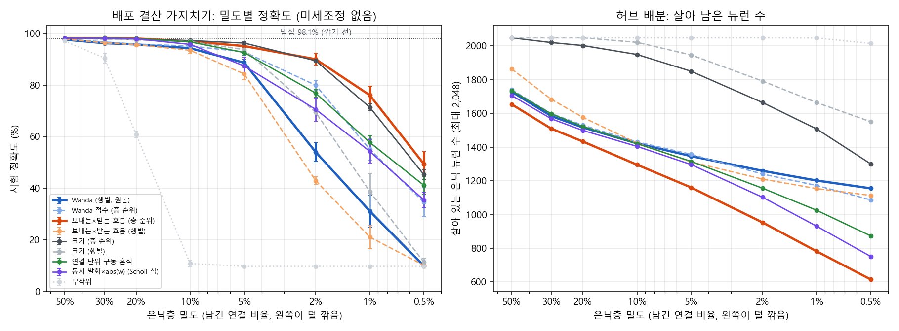
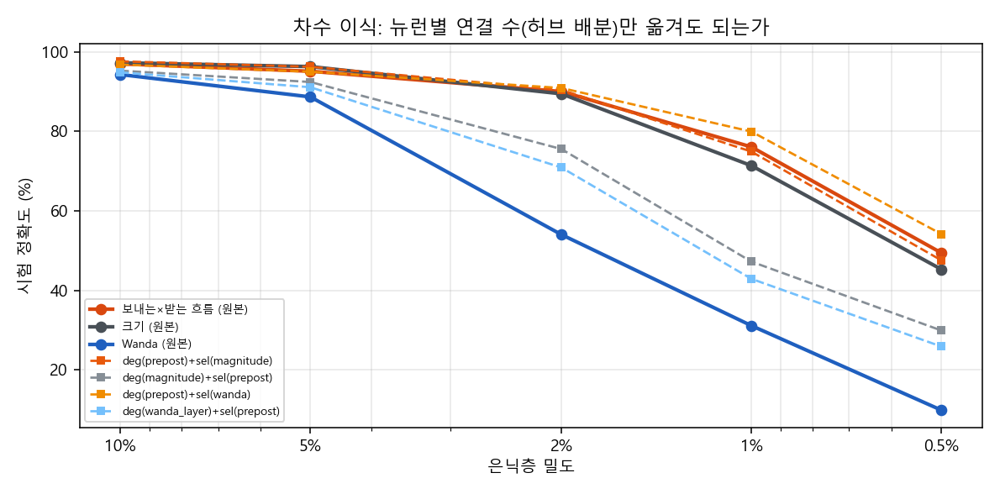

# 논문 2 파일럿 보고서 (정본, 2026-10-07 오후 갱신)

아침 보고서(`REPORT_MORNING.md`)를 대신하는 정본입니다. 아침 이후 외부 검토 2건과 코드 검토(검토자 3 + 종합 1)를 반영했고, 아침 보고서의 수치 일부를 철회했습니다(1절). 사용자 제안대로 **H1(일하면서 흐름만 보고 자르기)을 중심에, H2(감사팀 없이 배우기)를 둘째 장에** 두었습니다.

예측 등록 `PREDICTIONS.md`(모든 추가 실험은 실행 전 등록, 시각 포함), 계획·선행연구 `docs/plans/p3.md`, 코드 `experiments/p3/`(H1: `h1.py`·`h1c.py`, H2: `h3.py`), 표 `tables_h1c.md`·`tables.md`, 그림 `fig_h1c_sweep.png`·`fig_h1c_transplant.png`.

## 1. 아침 보고서에서 바뀐 것 (정정)

| 아침 보고서의 주장 | 지금 | 이유 |
|---|---|---|
| "학습 마스크 90.6% vs 무작위 마스크 24.1%, 66점 차이" | **철회** | 무작위 마스크 세 시드 모두 선택 학습률에서 59~71%까지 배운 뒤 발산했고, 24.1은 1/3 학습률 재시도(학습 문턱 아래)가 만든 값입니다. 참값은 24~70 사이로 모릅니다. v3 재실행 중입니다. |
| P2 "틀림(실질적으로)" | **부분 맞음** | 등록 규칙(평균 차 > 표준편차 합)으로는 dense → 0.5% 격차 감소(8.8 → 7.3)가 확실합니다. 다만 1.4점으로 작고, 단조 실패는 학습률이 섞인 1% 칸 때문입니다. |
| "O(n) 흔적(77.7)이 O(n²) 흔적(72.3)보다 높다" | **"나쁘지 않다"로 낮춤** (학습 배분) | 시드 하나에서 역전되어 확실성 규칙 미달입니다. 단, Wanda 본래 프로토콜(4절)에서는 76.1 vs 57.8로 확실히 높습니다. |
| "Wanda 식은 크기보다 나빴다(41.5 vs 53.2)" | **라벨 정정** | 그 기준은 Wanda가 아니라 abs(w)×평균|x|(층 순위)였습니다. Wanda 충실 재현(abs(w)×‖X‖₂, 행별)은 28.3입니다. |
| "모든 회사가 백지에서 출발" | **정정** | 학습 마스크 + 되감은 초기값은 학습 0걸음에서 이미 20.1%(0.5%)·28.4%(1%)입니다(나머지 회사 9~11%). |
| "크기 기준보다 24.5점 높다" | **배분에 따라 다름** | 출력층을 깎는 배분에서만 맞습니다. Wanda 본래 배분(출력층 유지)에서는 +4.7점이고 확실성 규칙 미달입니다(4-4절). |

## 2. 한눈에

1. **Wanda의 본래 영역(50%)에서는 모든 기준이 비깁니다(0.6점 안).** 30%부터 우리 기준이 Wanda를 2점 확실히 앞서고, 5%에서 6점, 2%에서 36점, 1%에서 **45점**(76.1 vs 31.2) 차이로 갈립니다.
2. **갈리는 이유는 "뉴런마다 같은 예산"입니다.** Wanda는 출력 뉴런마다 같은 수의 입력을 남기는데, 극단 희소에서는 이것이 붕괴의 원인입니다. 같은 Wanda 점수를 층 전체 순위로 바꾸기만 해도 31.2 → 55.1, **우리 기준이 정한 뉴런별 예산을 Wanda에 이식하면 31.2 → 79.9**로 오릅니다(시험한 조합 중 최고). 그 예산은 받는 뉴런이 얼마나 바쁜지를 따라갑니다(스피어만 0.80~0.99, 10%→0.5%) — 허브 배분입니다.
3. **규칙 자체는 새롭지 않습니다.** Scholl, Rule & Hennig(2021)이 볼츠만 기계에서 시냅스 전·후 활동과 가중치로 만든 국소 규칙을 이미 제안했고, "중요한 가중치가 특정 뉴런에 몰리고 뉴런이 통째로 빠진다"는 같은 현상을 보고했습니다. 우리 새로움은 **측정**입니다 — 깊은 판별망, 배포 상태·재학습 없음, 50%→0.5% 곡선을 Wanda 본래 프로토콜과 나란히, 그리고 이유를 차수 이식으로 인과적으로 가른 것.
4. **주의할 점 두 가지.** (가) 단순한 크기 기준(층 순위)과는 Wanda 본래 배분에서 거의 비깁니다(1%에서 +4.7점, 불확실; 5%에서는 크기가 1.2점 확실히 앞섬). (나) 논문 1의 CNN에서는 뉴런별 정규화 없이 활동 기반 규칙이 채널을 죽여 무너졌습니다. 허브 배분은 그 반대 방향이라, CNN에서 같은 측정을 하기 전에는 일반화할 수 없습니다.

## 3. 선행연구와 우리 차이 (실험 전·후 원문 확인)

- **Scholl, Rule & Hennig 2021** (PLoS Comput Biol 17(10): e1009458, 원문 확인): RBM·DBM에서 가중치의 피셔 정보를 국소적으로 추정해 가지치기합니다 — 시냅스 전·후 동시 발화 평균, 그리고 가중치와 평균 발화율로 만든 근사 σ(b_h)·σ(b_v + w). 반복마다 재학습. 크기 기준보다 은닉 뉴런을 더 많이 제거해 부호화가 효율적이고, 중요한 가중치가 특정 뉴런에 몰린다고 보고합니다. **우리 '보내는×받는 흐름' 규칙과 허브 관찰의 직접 선행이며 꼭 인용합니다.** 논문 1의 국소 규칙 절에도 인용이 필요해 보입니다.
- **Sun 등 2024 Wanda** (ICLR): abs(W)×‖X‖₂, 출력 뉴런(행)별 비교, 기울기·재학습 없음. LLM 50%(최대 80%) 용도이고, 저자들도 극단 희소에서는 작은 밀집 모델이 낫다고 적었습니다.
- **Zhang 등 2024 RIA** (ICLR): 행합·열합 정규화 — 뉴런 사이를 고르게 만드는 방향으로, 허브 배분과 반대입니다.
- **Yin 등 2024 OWL** (ICML, 원문 확인): 층마다 다른 밀도(이상치 비율 기반)로 70%에서 Wanda 대비 퍼플렉서티 61.22 개선 — **층 단위** 비균일 배분의 선행입니다. 우리 관찰은 **뉴런 단위**입니다.
- Navlakha 등 2015(사용 기반 감소율 가지치기), Hu 등 2016 APoZ(활동 통계로 뉴런 가지치기), SparseGPT 2023, DSnoT 2024, SET·Deep Rewiring 2018.

**우리 차이(새로움 = 측정).** 규칙은 Scholl 2021과 같은 계열입니다. 새로운 것은 (1) 깊은 ReLU 판별망에서 배포 상태·재학습 없이 50%→0.5%를 Wanda 본래 프로토콜과 나란히 그려 "어디서 갈리는지"를 보인 것, (2) 그 이유가 뉴런 단위 허브 배분임을 행별/층 순위 비교와 **차수 이식**으로 인과적으로 가른 것, (3) 뉴런 단위 흔적(O(n))이 연결 단위 흔적(O(n²))보다 나쁘지 않거나 낫다는 "싼 매질" 측정입니다.

## 4. H1 결과 — 일하면서 흐름만 보고 자르기

설정: 역전파로 학습한 밀집 MLP(784-1024-1024-10, 98.1%)를 배포해 라벨 없는 스트림(훈련 집합 1 에폭)을 흘리며 흔적을 쌓고, 한 번에 자릅니다. 미세조정 없음. 시드 3, 평균±표준편차.

### 4-1. 밀도 스윕 (Wanda 본래 프로토콜: 은닉 두 층을 같은 밀도로, 출력층은 유지)

| 기준 | 50% | 30% | 20% | 10% | 5% | 2% | 1% | 0.5% |
|---|---|---|---|---|---|---|---|---|
| **Wanda (행별, 원본)** | 97.6±0.1 | 96.2±0.2 | 95.7±0.4 | 94.3±1.0 | 88.7±1.3 | 54.0±3.6 | 31.2±6.1 | 9.9±0.0 |
| Wanda 점수 (층 순위) | 97.9±0.0 | 96.7±0.2 | 95.9±0.3 | 95.1±0.7 | 92.8±1.4 | 79.9±1.9 | 55.1±4.1 | 34.6±5.6 |
| **보내는×받는 흐름 (층 순위, 우리)** | 98.1±0.0 | 98.2±0.0 | 98.0±0.1 | 97.0±0.2 | 95.1±0.6 | 90.0±2.3 | 76.1±3.4 | 49.5±4.7 |
| 보내는×받는 흐름 (행별) | 97.8±0.1 | 96.4±0.1 | 95.6±0.4 | 93.5±1.3 | 84.3±2.3 | 43.0±1.4 | 21.1±4.5 | 10.2±0.4 |
| 크기 (층 순위) | 98.2±0.1 | 98.0±0.1 | 97.8±0.1 | 97.2±0.2 | 96.3±0.4 | 89.4±0.7 | 71.4±1.4 | 45.3±2.1 |
| 크기 (행별) | 98.1±0.1 | 97.8±0.1 | 97.5±0.2 | 96.9±0.3 | 93.7±0.5 | 69.4±0.5 | 38.8±7.1 | 11.4±1.4 |
| 연결 단위 구동 흔적 (O(연결)) | 98.2±0.1 | 98.3±0.1 | 98.0±0.1 | 96.7±0.4 | 92.6±1.1 | 76.9±1.5 | 57.8±2.7 | 41.2±3.5 |
| 동시 발화×abs(w) (Scholl 식, O(연결)) | 98.2±0.1 | 98.2±0.0 | 97.9±0.2 | 95.8±0.8 | 87.4±3.4 | 70.6±4.5 | 54.3±4.6 | 35.5±2.9 |
| 동시 발화 (가중치 없음) | 98.1±0.1 | 96.0±0.0 | 88.4±1.7 | 61.9±4.1 | 45.6±11.2 | 31.0±9.6 | 23.1±7.4 | 18.9±8.3 |
| 흐름만 (가중치 없음) | 98.2±0.1 | 97.9±0.1 | 97.0±0.1 | 94.5±0.9 | 84.9±2.7 | 55.2±6.4 | 32.4±10.1 | 19.9±5.0 |
| 무작위 | 97.1±0.2 | 90.5±1.9 | 60.9±1.3 | 10.8±1.1 | 9.7 | 9.7 | 9.7 | 9.7 |

은닉층 밀도 1%는 출력층(10,240개)을 유지하므로 전체 밀도로는 1.54%입니다.

- **Q6 맞음.** 50%에서 Wanda·우리·크기 모두 밀집과 0.6점 안입니다. Wanda의 본래 영역에서는 이길 것이 없습니다.
- **Q7 대체로 맞음.** 우리 − Wanda 차이는 30%에서 2.0점(확실), 10%에서 2.7점, **5%에서 처음 5점을 넘고**(6.4) 2%에서 36점, 1%에서 45점입니다. 0.5%에서는 40점으로 조금 줄어 "단조 증가"는 아닙니다.
- **행별 판은 모두 무너집니다.** 크기(행별) 38.8, 우리(행별) 21.1, Wanda 31.2(1%) — 같은 점수라도 층 순위로 바꾸면 각각 71.4, 76.1, 55.1입니다. 붕괴는 점수가 아니라 "뉴런마다 같은 예산"에서 옵니다.
- **크기(층 순위)와는 거의 비깁니다.** 50~10%는 동률, 5%에서는 크기가 1.2점 확실히 앞서고, 2%는 동률, 1%·0.5%에서 우리가 4~5점 앞서지만 확실성 규칙 미달입니다.
- **가중치를 빼면 무너집니다.** 동시 발화(가중치 없음)는 10%에서 이미 61.9, 흐름만은 5%부터 크기보다 11점 이상 낮습니다.

### 4-2. 허브 지표 (살아 있는 은닉 뉴런 / 2층 입력 수 지니계수 / 2층 입력 수와 받는 뉴런 활동의 스피어만 상관)

| 기준 | 10% | 2% | 1% |
|---|---|---|---|
| Wanda (행별) | 1422 / 0.00 / 0.01 | 1259 / 0.00 / 0.01 | 1202 / 0.00 / 0.01 |
| Wanda 점수 (층 순위) | 1431 / 0.13 / 0.67 | 1240 / 0.23 / 0.64 | 1172 / 0.28 / 0.62 |
| 크기 (층 순위) | 1949 / 0.23 / 0.67 | 1664 / 0.36 / 0.71 | 1508 / 0.42 / 0.71 |
| 연결 단위 구동 흔적 | 1420 / 0.37 / 0.96 | 1156 / 0.52 / 0.97 | 1025 / 0.58 / 0.96 |
| **보내는×받는 흐름 (우리)** | 1295 / 0.49 / 0.99 | 953 / 0.70 / 0.95 | **782 / 0.76 / 0.89** |

**Q8 맞음.** 우리 기준은 살아 있는 뉴런이 가장 적고(1%에서 2,048개 중 782개), 입력이 가장 불균등하게 몰리며(지니 0.76, 상위 10% 뉴런이 연결의 56%), 그 몰림이 받는 뉴런의 활동을 따라갑니다(0.80~0.99). Wanda(행별)는 정의상 지니 0입니다. Scholl 2021의 "중요한 가중치가 특정 뉴런에 몰린다"를 깊은 망·극단 희소에서 수치로 재현한 셈입니다.

### 4-3. 차수 이식 — 허브 배분만 옮겨도 되는가

"각 뉴런이 입력을 몇 개 갖나"는 한 기준에서, "그 뉴런 안에서 어느 입력을"은 다른 기준에서 가져왔습니다.

| 조합 | 10% | 5% | 2% | 1% | 0.5% |
|---|---|---|---|---|---|
| Wanda 원본 (행별 같은 예산 + Wanda 선택) | 94.3 | 88.7 | 54.0 | 31.2 | 9.9 |
| **우리 예산 + Wanda 선택** | 96.8±0.2 | 95.0±0.6 | 90.9±2.2 | **79.9±2.5** | **54.2±3.2** |
| 우리 예산 + 크기 선택 | 97.6±0.2 | 96.2±0.4 | 90.4±1.9 | 74.9±2.5 | 47.6±2.7 |
| 우리 원본 (우리 예산 + 우리 선택) | 97.0±0.2 | 95.1±0.6 | 90.0±2.3 | 76.1±3.4 | 49.5±4.7 |
| 크기 예산 + 우리 선택 | 95.3±0.7 | 92.4±1.7 | 75.5±2.5 | 47.2±0.9 | 29.9±2.8 |
| Wanda 점수(층) 예산 + 우리 선택 | 94.8±0.9 | 91.1±1.9 | 70.9±1.6 | 42.9±0.4 | 25.9±2.2 |

(항등 점검: 우리 예산 + 우리 선택을 이식 코드로 다시 만들면 원본과 소수점까지 같습니다.)

**Q9 맞음.** 우리 예산에 크기 선택을 붙이면 (우리 − 크기) 격차의 74%를 회복하고(1%), 반대로 크기 예산에 우리 선택을 붙이면 둘 다보다 훨씬 나빠집니다(47.2). **우리 예산 + Wanda 선택이 시험한 조합 중 최고**입니다(1%에서 79.9, Wanda 원본보다 48.7점). 즉 "Wanda의 뉴런 안 선택은 좋고, 극단 희소에서 모자란 것은 뉴런 사이 예산 배분"입니다. 예산과 선택을 엇갈리게 섞으면 무너지는 것(47.2, 42.9)은 층 사이 경로가 어긋나기 때문으로 보입니다(4-4절).

### 4-4. 배분 방식과 층 사이 끊긴 경로 (탐색, 사후 가설로 표시해 등록)

아침 보고서의 "+24.5점 vs 크기"가 왜 Wanda 본래 배분에서는 +4.7점으로 줄었는지 보려고, 같은 기준을 배분 방식 셋에서 비교했습니다. 표는 1% 기준 정확도 / 낭비 연결 비율(입력 없는 뉴런에서 나가거나 출력 없는 뉴런으로 들어가는 연결) / 살아 있는 은닉 뉴런입니다.

| 배분 | 크기 (층) | 우리 (층) | Wanda (행별) | 연결 단위 구동 |
|---|---|---|---|---|
| 은닉 균일 + 출력층 유지 (Wanda 본래) | 71.4 / 4.2% / 1508 | 76.1 / 16.2% / 782 | 31.2 / 23.6% / 1202 | 57.8 / 9.7% / 1025 |
| 학습 배분 (출력층 10%만 남김, 아침 H1) | 53.2 / 13.6% / 1164 | **77.7 / 6.0% / 545** | 28.3 / 67.0% / 557 | 72.3 / 10.0% / 757 |
| 출력층까지 균일 1% | 18.5 / 47.8% / 660 | 24.7 / 36.2% / 271 | 16.8 / 88.7% / 235 | 33.4 / 44.9% / 314 |

출력층을 깎으면 크기 기준은 막다른 길에 예산의 13.6%를 쓰고 53.2로 떨어지지만, 우리 기준은 6.0%만 쓰고 77.7을 지킵니다. 같은 뉴런의 활동이 그 뉴런으로 "들어오는" 연결 점수(받는 흐름)와 "나가는" 연결 점수(보내는 흐름)에 함께 들어가, 층 사이 경로가 저절로 맞물리기 때문으로 해석합니다(가설). Wanda(행별)는 출력층까지 행별로 깎으면 연결의 67%가 막다른 길입니다. 다만 출력층을 유지하는 배분에서는 우리 기준이 오히려 더 많이 낭비하는데(16.2% vs 4.2%) 정확도는 떨어지지 않아, 낭비만으로 모든 차이를 설명하지는 못합니다.

### 4-5. 아침 H1 표 (학습 배분) — Wanda 충실 재현 추가

| 기준 | one-shot 1% | one-shot 0.5% | 4회 결산 1% | 4회 결산 0.5% |
|---|---|---|---|---|
| 크기 (층) | 53.2±1.8 | 28.2±4.7 | 53.2±1.8 | 28.2±4.7 |
| **Wanda (행별, 충실 재현)** | 28.3±7.5 | 11.2±2.0 | 33.4±8.5 | 12.3±2.1 |
| Wanda 점수 (층) | 47.4±2.1 | 31.6±6.1 | 50.5±3.9 | 32.8±4.3 |
| abs(w)×평균\|x\| (층) — 아침의 "Wanda 식" 정정 | 41.5±4.2 | 27.6±3.8 | 43.0±4.1 | 27.1±2.3 |
| **보내는×받는 흐름 (층, 우리)** | **77.7±5.1** | **55.5±5.0** | 64.8±4.3 | 48.1±7.2 |
| 보내는×받는 흐름 (행별) | 22.2±7.2 | 10.8±1.5 | 31.3±5.0 | 13.5±2.7 |
| 연결 단위 구동 흔적 | 72.3±1.6 | 54.2±1.9 | 53.5±0.7 | 35.3±1.5 |
| 흐름만 (가중치 없음) | 33.5±6.3 | 21.8±7.4 | 30.3±3.1 | 21.7±3.8 |

"무작위" 행(9.7)은 우연 수준이 아니라 편향만 남아 한 클래스(8)만 답하는 상태입니다.

### 4-6. H1 판정 모음

| 예측 | 판정 |
|---|---|
| Q1 우리 기준은 1%에서 크기보다 1점 이상 낮지 않다 | 맞음 (학습 배분 +24.5 확실, Wanda 본래 배분 +4.7 불확실) |
| Q2 가중치 없는 공식은 크기보다 10점 이상 낮다 | 맞음 |
| Q3 4회 결산이 one-shot보다 1점 이상 높다 | 틀림 — 세 시드 모두 3~15점 낮았으나 확실성 규칙은 미달 |
| Q4 방송 상관 흔적 | 숫자상 맞음, 혼입 대조 없어 주장에서 제외 |
| Q5 O(n²) 흔적은 O(n)과 0.5점 안 | 틀림 — 학습 배분에서는 O(n)이 5점 높되 불확실, Wanda 본래 배분에서는 O(n)이 18점 확실히 높음 |
| Q6 50%에서 모두 1점 안 | 맞음 |
| Q7 차이가 10% 이하에서 처음 5점 초과, 계속 증가 | 대체로 맞음 (5%에서 처음 초과, 0.5%에서 조금 감소) |
| Q8 허브 (뉴런 적음·지니 높음·활동 상관 > 0.5) | 맞음 |
| Q9 차수 이식으로 격차의 70% 이상 회복 | 맞음 (74%, 우리 예산 + Wanda 선택이 최고) |
| Q10 Scholl 식 연결 단위는 우리와 3점 안, 가중치 없는 기준은 붕괴 | 앞 절반 틀림 (1%에서 21.8점 낮음), 뒤 절반 대체로 맞음 |

**Q3 해석(외부 검토 제안과 같음).** 학습 없이 네 번 나눠 자르면 한 번에 자르는 것보다 나쁩니다. 천천히 깎는 것이 좋은 이유는 "천천히"가 아니라 "자르는 사이에 다시 배울 시간"이라는 해석과 일관되며, 논문 1에서 점진 스케줄이 이득의 73~81%를 차지한 것을 설명하는 조각입니다(인과 증명은 아닙니다).

## 5. H2 — 감사팀 없이 배우기 (둘째 장)

### 5-1. 아침 결과(v2)와 검토가 찾은 결함

아침의 H2 표는 그대로 인용하면 안 됩니다. 코드 검토가 확인한 결함은 다음과 같습니다.

- **[치명]** 무작위 마스크 0.5%의 24.1(가중치 섭동)·49.6(노드 섭동)은 재시도 규칙(학습률 1/3)의 산물입니다. "66점 차이"는 철회합니다.
- 학습률을 3 에폭·상수로 고르고 15 에폭·코사인으로 보고해 프로토콜이 달랐고, 재시도가 pruned 1%의 fg·wp 칸을 학습률 혼합으로 만들었습니다(P2 단조 실패와 P3 1% 실패의 원인).
- 무작위 1%의 싼 학습기 학습률은 격자 전부가 우연 수준이라 선택 자체가 무효였습니다.
- 검증 분할 없이 시험 집합으로 학습률·수락을 정했습니다(큰 차이는 흔들리지 않지만 1~3점 주장은 확정 불가).
- 죽은 뉴런의 편향까지 흔들어 pruned의 섭동 차원이 작은 밀집망보다 10~17% 컸습니다.
- 가중치 섭동(wp)과 순방향 기울기(fg)는 같은 난수 방향을 써서 두 열의 일치는 독립 증거가 아닙니다.
- 탐침의 신호/잡음비 값은 퇴화한 지표였습니다(모든 칸에서 약 0.143). 코사인만 씁니다.

살아남는 것: 코사인이 활성 연결 수에 따라 12.8배 좋아진다는 것(P5, 관측식은 sqrt(K/n), n = 활성 가중치 + 편향), 0.5%에서 학습 마스크가 같은 예산 작은 밀집망보다 높다는 것(90.6 vs 85.1 — 단 학습 0걸음 차이 20.1 vs 8.6을 빼면 학습으로 번 점수는 작은 망이 더 큽니다), 역전파·DFA에서 학습 마스크 > 무작위 마스크.

### 5-2. v3 재실행 (진행 중)

검증 5k 분할, 같은 코사인 스케줄로 학습률 선택(×2 간격), 발산 시 체크포인트 3개 중 가장 오래된 것으로 되돌리고 학습률 절반(v3.1 — v3.0은 직전 체크포인트가 이미 터지기 직전이라 같은 자리에서 반복 발산해 폐기), 학습 0걸음 기록, 죽은 뉴런 편향 제외. 회사 추가: **pruned_reinit**(학습 마스크 + 다른 초기값 — 슈퍼마스크 결합 분리), **random_degree**(학습 마스크와 모든 뉴런의 입·출력 연결 수가 같고 연결 쌍만 섞은 차수 보존 무작위 — 끊긴 뉴런 불공정 제거). 학습기 bp·dfa·np·fg, 회사 11 × 시드 3 + 45 에폭 수렴 확인. 예측 P7~P9 등록. 예상 완료 20~21시, 끝나면 이 절을 채웁니다.

## 6. 해석과 논문 2 구성 제안

**중심 질문을 바꿉니다.** "폰 노이만 기계에서 어떤 매질이 싼가"에 대한 가장 분명한 답은 H1에서 나왔습니다 — 이미 흐르고 있는 활성값을, 뉴런 단위로, 연결 기록 없이 쓰면 됩니다. 그 매질이 결정하는 것은 "어느 연결을 남기나"보다 **"어느 뉴런에 얼마를 몰아주나"**이고, 극단 희소에서는 그것이 전부입니다.

**제안 구성.**
1. 1장(중심): 흐름으로 자르기 — 밀도 스윕(Wanda 본래 프로토콜), 허브 지표, 차수 이식, 배분과 끊긴 경로. 메시지: "극단 희소에는 허브 배분이 필요하고, 받는 뉴런의 활동이 그 배분을 공짜로 알려 준다."
2. 2장: 감사팀 없이 배우기(v3) — 구조가 싼 학습의 전제인지, 희소성 자체는 무엇을 사 주는지.
3. 다리: 결산 + 싼 재학습 — "자르는 사이에 배울 시간" 가설을 싼 학습기로 직접 시험(결산 사이에 노드 섭동·DFA 몇 에폭).

**넘어야 할 것.**
- **CNN.** 논문 1에서 활동 기반 규칙은 CNN에서 뉴런별 정규화(허브의 반대) 없이 채널을 죽였습니다. 허브 배분이 MLP 한정인지 CNN에서도 같은지가 1장의 일반성을 정합니다. 가장 먼저 할 실험입니다.
- **크기 기준과의 차이.** Wanda 본래 배분에서 우리 기준은 크기와 거의 비깁니다. 1장의 주장은 "Wanda를 이긴다"와 "출력층까지 깎을 때 경로를 지킨다"로 한정해야 합니다.
- **LLM 한 점.** Wanda의 본래 무대에서 "활동 비례 뉴런별 예산"이 70~90% 희소에 도움이 되는지 — 층 단위 배분은 OWL(2024)이 이미 했으니, 뉴런 단위 배분의 선행연구부터 확인해야 합니다.

## 7. 실패·고친 것

- 아침 보고서 수치 6건 철회·정정(1절).
- v3.0 발산 복원 결함: 직전 체크포인트로 되돌려 같은 자리에서 반복 발산 → v3.1(체크포인트 3개, 손실 20 초과도 발산으로)로 고쳐 학습률 선택부터 다시 시작했습니다.
- 체인 3(차수 보존 회사)은 마감 파일을 잘못 적어 대부분 건너뛰었고, 이어 검토 결과에 따라 v3로 대체했습니다.
- 예측 등록의 수정 기록 시각 3건을 시계 확인 없이 적었다가 실제 시각으로 바로잡았습니다(14:30·14:38·14:40·14:44).
- 셸 heredoc이 파이썬 문자열의 \n을 실제 줄바꿈으로 바꿔 h1c 코드가 한 번 깨졌습니다(즉시 수정).
