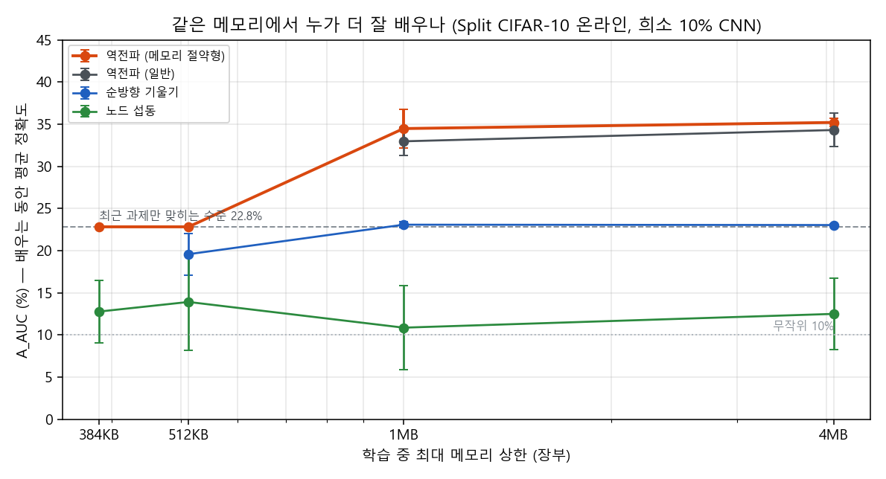

# 아침 보고서: 채점 방식을 "같은 비용"으로 바꿨을 때 (2026-10-08)

실행 02:54~05:25, RTX 3060 Ti, 오류 0. 계획·선행연구 `docs/plans/p4.md`, 예측 등록 `results/p4/PREDICTIONS.md`(실행 전 등록 1회, 실행 전 수정 2회, 추가 1회, 모두 시각 기록), 코드 `experiments/p4/`, 표 `results/p4/tables.md`, 그림 `results/p4/fig_p4.png`.

## 1. 한눈에

1. **"같은 메모리에서는 싼 학습이 이긴다"는 이 규모에서 틀렸습니다.** 메모리 상한을 똑같이 걸어도 역전파(감사팀)가 가장 잘 배웠습니다. 역전파 없는 방법들은 "가장 최근 과제만 맞히는 수준"(22.8%)을 넘지 못했습니다. 선행연구(Panchal 2026 등)와 같은 결론입니다.
2. **이유는 계산만으로 먼저 나왔습니다.** 작은 CNN에서는 첫 단계의 큰 그림 데이터가 모든 학습 방법의 메모리를 차지합니다. 역전파 없는 방법이 아끼는 메모리는 생각보다 작아서, 복습용 저장소를 최대 수십 %밖에 늘리지 못했습니다.
3. **덤으로 중요한 정정이 하나 나왔습니다.** p3에서 "큰 회사에서는 사장 방송(노드 섭동)이 묻혀 학습이 무너진다, 희소하게 정리해야 안정된다"고 했습니다. 실제 원인은 회사 크기가 아니라 **가중치가 점점 커지며 퍼지는 것**이었습니다. 가중치 감쇠 하나만 주면 큰 밀집망도 92.3%로 잘 배웁니다. 희소망(90.4%)이나 작은 망(91.4%)보다 오히려 높습니다.

## 2. 무엇을 바꿨나 — 채점 방식

비유로 설명하면, 지금까지는 **최고 속도**로만 시합했습니다. 이번에는 **같은 연료통**(메모리 상한)을 주고 누가 더 멀리 가는지를 봤습니다.

- **회사**: 작은 CNN(전화선 13.8만 개). 희소 10% 회사는 선의 90%를 미리 끊은 회사입니다.
- **일**: CIFAR-10 사진을 두 종류씩 다섯 번에 걸쳐 새로 배웁니다(온라인 연속 학습, 사진은 한 번만 봄). 앞에서 배운 것을 잊지 않으려면 **복습 노트**(재현 버퍼, 옛 사진 보관함)가 필요합니다.
- **연료통 = 메모리 상한**: 384KB / 512KB / 1MB / 4MB. 연료통 안에 회사(가중치), 학습 중 필요한 작업 공간, 복습 노트를 모두 담아야 합니다. 작업 공간을 덜 쓰는 방법은 남는 공간을 복습 노트에 쓸 수 있습니다. 이것이 "싼 방법이 이길 수 있는 유일한 길"이었습니다.
- **선수 넷**: 역전파(감사팀), 메모리 절약형 역전파(회의록 일부만 보관하고 필요할 때 다시 계산, 수정도 그 자리에서 바로), 순방향 기울기(살짝 흔들어 보고 방향 맞히기), 노드 섭동(사장 방송).

## 3. 결과

희소 10% 회사, 배우는 동안의 평균 정확도(A_AUC, %), 시드 3개입니다.

| 메모리 상한 | 메모리 절약형 역전파 | 역전파 | 순방향 기울기 | 노드 섭동 |
|---|---|---|---|---|
| 384KB | 22.8 (복습 노트 0) | 안 들어감 | 안 들어감 | 12.8 (복습 노트 0) |
| 512KB | 22.8 (0) | (절약형과 같음) | 19.6 (0) | 13.9 (8장) |
| 1MB | **34.5** (147장) | 33.0 (100장) | 23.1 (106장) | 10.9 (179장) |
| 4MB | **35.2** (1,170장) | 34.3 (1,123장) | 23.0 (1,129장) | 12.5 (1,203장) |

**기준선 두 개를 알고 보셔야 합니다.**
- 무작위로 찍으면 10%입니다.
- **"지금 배우는 과제의 두 종류만 찍기"는 22.8%**입니다. 앞에서 배운 것을 다 잊고 최근 것만 기억하는 상태입니다.

**읽는 법.**
- **복습 노트가 있어야 배웁니다.** 1MB·4MB에서 역전파만 22.8%를 넘었습니다(33~35%). 384KB·512KB에서는 복습 노트를 둘 자리가 없어서 역전파도 "최근 것만 기억" 수준(22.8%)에 갇혔습니다. 세 시드가 소수점까지 같았는데, 그만큼 완전히 그 상태에 갇혔다는 뜻입니다.
- **역전파 없는 방법은 복습 노트가 더 커도 못 이겼습니다.** 노드 섭동은 4MB에서 역전파보다 복습 노트를 33장 더 가졌습니다(1,203 vs 1,170). 그래도 12.5%로 거의 무작위 수준이었습니다. 순방향 기울기는 23%로 "최근 것만" 수준이었습니다. 연료를 조금 아껴도 엔진(배우는 방식) 차이가 훨씬 컸습니다.
- **연산으로 채점하면 차이가 더 벌어집니다.** 사진 한 장당 계산량이 역전파 1.5~2배, 노드 섭동 2배, 순방향 기울기 6배였습니다(순전파 한 번 = 1). 같은 계산을 쓰고도 역전파가 훨씬 높습니다.
- 밀집 회사(가중치만 540KB)는 4MB에서만 모두 들어갔습니다. 그런데 학습률이 희소 회사에 맞춰져 있어 대부분 "최근 것만" 수준에 갇혔습니다. 이 결과는 판정에 쓰지 않습니다.

## 4. 예측 판정

| 예측 | 판정 |
|---|---|
| A1 4MB에서 최선 역전파가 최선 역전파 없는 방법보다 5점 이상 | **맞음** (35.2 vs 23.0, 12점) |
| A2 (결정) 가장 작은 상한에서 역전파 없는 방법이 아낀 메모리로 복습해 2점 이상 이김 | **틀림** — 384KB에서 노드 섭동 12.8 vs 절약형 역전파 22.8. 둘 다 복습 노트가 없어 비교할 거리가 거의 없었고, 이 규모에서는 주장을 폐기합니다 |
| A3 연산 축으로 채점하면 모든 상한에서 역전파 승 | **맞음** |
| A4 (계산) MNIST MLP에서는 활성값이 메모리의 10% 미만이라 이점이 원리적으로 없음 | **맞음** (약 1.5%) |
| A5 256KB 이하에서는 밀집 회사가 아예 안 들어감 | **맞음** — 실제로는 희소 회사도 256KB에 안 들어가 상한을 384KB부터로 고쳤습니다(실행 전 등록) |
| A6 384KB에서 절약형 역전파가 노드 섭동보다 10점 이상 | 숫자상 맞음(10.0점). 다만 역전파 쪽이 "최근 것만" 상태라 의미가 약합니다 |
| B1 큰 밀집망 노드 섭동도 가중치 크기를 잡아 주면 85% 이상 | **맞음** (가중치 감쇠 92.3%, 행별 정규화 91.2%, 실패 0/3) |
| B2 (탐색) 가중치 감쇠를 주면 밀집·희소·작은 망이 1점 안 | 숫자상 틀림(밀집 92.3 > 작은 망 91.4 > 희소 90.4). 다만 요지는 더 강하게 맞습니다 — **희소성 자체가 주는 안정은 없고, 오히려 밀집이 가장 높습니다** |

## 5. 이것이 연구에 뜻하는 것

- **"뇌 방식은 싸서 이긴다"는 GPU 위에서는 메모리로 재도 서지 않았습니다.** 이유는 셋입니다. ① 작은 망에서는 큰 그림 데이터가 메모리를 지배합니다. ② 역전파도 메모리를 아끼는 기법(다시 계산하기, 그 자리에서 수정하기)이 있습니다. ③ 싼 학습은 엔진 성능 차이가 너무 큽니다. 선행연구(Panchal 2026: 다시 계산하는 역전파가 비슷한 메모리로 최대 31점 높고 연산은 3.8배 적음)와 같은 방향입니다.
- **p3의 정정.** "희소하게 정리하면 사장 방송이 잘 통한다"는 철회합니다. 방송이 묻힌 원인은 직원 수가 아니라 **가중치가 점점 커지며 퍼지는 것**이었습니다. 가중치 감쇠(주기적으로 조금씩 줄이기) 하나로 해결됐습니다. 이것은 Hiratani 등(2022)의 설명과 일치합니다. 뇌로 치면 시냅스 항상성(Turrigiano)이나 수면 중 전체 시냅스 축소(Tononi & Cirelli)와 닮은 장치입니다. 논문 1에서 수면 감쇠는 효과가 없었지만, 싼 학습기에서는 "감쇠"가 학습 자체를 가능하게 만드는 조건이었습니다.
- **논문 2에 대한 제 의견.** 지금까지 결과를 모으면 하나의 정직한 "감사 보고서" 논문이 됩니다. 제목을 예로 들면 "뇌의 싸다는 장점은 GPU에서 무엇을 사 주는가"입니다. ① 흐름만 보고 자르기는 정규화 층이 없는 망에서만 통합니다(H1, MLP 성공 / BN CNN 실패). ② 싼 학습기의 안정은 희소성이 아니라 가중치 감쇠에서 옵니다(H2 정정). ③ 같은 메모리·같은 연산으로 채점하면 역전파가 이깁니다(P4). 논문 1의 "번역에서 무엇이 살아남는가"를 비용 축으로 이어 가는 구성입니다. 다만 결과가 대부분 부정이라, 낼 곳(워크숍, 부정 결과 트랙)을 먼저 정해야 합니다.

## 6. 정직하게 적을 한계

- 실험 무대가 매우 어려웠습니다. 사진을 한 장씩 한 번만 보고(배치 1), 과제당 2,000장만 썼습니다(시간 때문에 실행 전에 줄였습니다). 역전파도 마지막 정확도가 15~21%였습니다.
- 학습률은 1MB·복습 있음 조건에서 골랐습니다. 그래서 복습이 없는 384·512KB와 밀집 회사에서는 역전파가 "최근 것만" 상태로 무너졌을 수 있습니다. 그 칸의 역전파 수치는 하한으로 보셔야 합니다.
- 메모리는 이상적 구현을 가정한 계산 장부입니다. GPU 실측(수백 MB)은 작업 공간·캐시가 섞여 비교할 수 없어 참고로만 기록했습니다.
- 선행연구 확인에서는 웹 검색 한도를 다 써서 논문 데이터베이스 API로 찾았습니다(검증 에이전트 29개, 오류 0).
